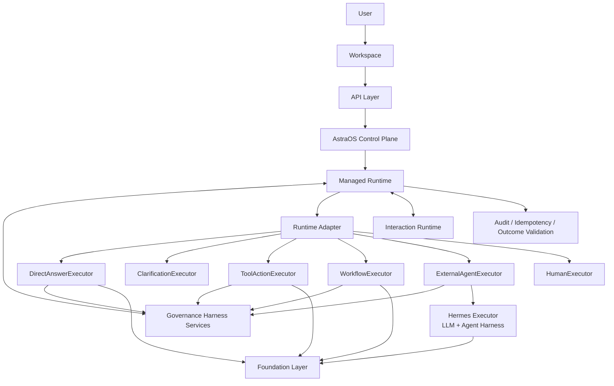

# AI Employee Harness 支持运行设计文档

更新时间：2026-07-16

本文档定义 AstraOS 在 Harness 支持、维护和运行体系下承载 AI Employee 的应用设计。本文档基于当前已有设计，不重新定义主架构，不替代 `ARCHITECTURE_BASELINE.md`、`RUNTIME_REMEDIATION_SPEC.md` 或 `TASK_PRESENTATION_CONTRACT.md`。

## 1. 文档定位

本文档回答一个问题：

```text
AstraOS 如何在不自研、不复制模型执行型 Agent Harness 的前提下，
受控使用外部 Agent Runtime 的执行能力，
并让 AI Employee 在 AstraOS Control Plane / Managed Runtime 下可靠运行。
```

当前 AstraOS 已有架构的核心判断是：

```text
AstraOS = Control Plane + Governance Harness Services + Managed Runtime + Executor Backends。

AI Employee = 由 AstraOS Control Plane 定义，并由 AstraOS Managed Runtime 托管运行的企业业务责任与治理对象。

Hermes / Agent Runtime = 可插拔 Executor Backend。
```

本文中的 Harness Engineering 需要区分模型执行、企业治理和持久运行三个边界。

Hermes 等 Agent Runtime 内部的 Execution Harness 负责：

- Agent loop。
- Prompt assembly。
- Executor-local model context。
- Tool calling loop。
- Skills / Subagents。
- Model adapter。
- Executor-local validation、retry 和 stop conditions。

AstraOS Governance Harness Services 负责：

- Context Envelope。
- Tool Gateway。
- Permission / Approval。
- Invocation Validation。
- Policy Enforcement。
- Idempotency Enforcement。
- Outcome Evidence Collection。

AstraOS Managed Runtime 负责：

- Durable Task Lifecycle。
- Interaction Persistence。
- Pause / Resume Coordination。
- Cross-executor Routing and Recovery。
- Reconciliation / Compensation。
- Human Takeover。

Audit、Observability 和 Evaluation 是独立横切能力，负责治理记录、运行诊断、效果评估和持续改进，不应被整体定义为第二套 Agent Harness。

因此，AstraOS 不自研模型执行型 Agent Harness，也不复制 Hermes 的 Agent loop、Prompt Assembly、模型上下文循环、Skills、Subagents 或模型适配系统。AstraOS 通过 Runtime Adapter / ExternalAgentExecutor 受控接入 Hermes 等 Agent Runtime，通过 Governance Harness Services 管理执行边界，并通过 Managed Runtime 管理长期可靠运行。

## 2. 设计目标

AI Employee 在 AstraOS 中需要成为可安装、可运行、可审批、可审计、可恢复、可替换执行后端的企业业务责任与治理对象。

目标包括：

- 用户以 Task 方式委托工作，而不是直接操作 Agent session。
- AI Employee 提供业务能力、策略和工具需求，不替代 Managed Runtime。
- Hermes Harness 可以负责单次执行内部的模型循环、上下文组织、工具请求、局部重试、Skills 和 Subagents。
- AstraOS 保持任务语义、权限、审批、审计、幂等、交互恢复和最终结果验收的主权。
- Workspace 只展示用户可理解的任务状态、等待原因、审批、结果和下一步，不展示 Runtime / Hermes 内部 trace。
- 外部 Harness 可以替换，Workspace 和 Control Plane 不因此重做。

## 3. 非目标

MVP 阶段不做：

- 自研模型执行型 Agent Harness。
- 复制 Hermes 的 Agent loop、Prompt Assembly、Model Adapter、Skills 或 Subagents。
- 把 Hermes 变成 AstraOS 的主权控制平面。
- 把 Workspace 做成 Agent trace 查看器。
- 让 Workflow 成为所有 Task 的中心。
- 让外部 Agent Runtime 直接读写 AstraOS 主业务数据库。
- 让外部 Agent Runtime 自主注册 ToolDefinition。
- 让 Harness 自学习结果自动改变 Employee 权限、工具和策略。
- 一次性实现完整微服务化 Runtime、分布式事件总线、完整 ABAC、多级审批链或复杂 Checkpoint 系统。

MVP 原则仍然是：

```text
逻辑上完整分层。
工程上模块化单体。
```

## 4. 总体架构



系统分工：

| 层级 | 职责 |
| --- | --- |
| Workspace | 用户委托任务、补充上下文、审批动作、查看结果 |
| API Layer | 账号、JWT、REST / WS、Workspace API、Marketplace API |
| Control Plane | AI Employee 定义、能力、知识范围、策略、Execution Profile、结果合同、模型与执行器配置 |
| Governance Harness Services | Context Envelope、Tool Gateway、Permission、Approval、Invocation Validation、Policy Enforcement、Idempotency Enforcement、Outcome Evidence Collection |
| Managed Runtime | Task 生命周期、Interaction 持久化、Pause / Resume、跨 Executor 路由与恢复、Reconciliation / Compensation、Human Takeover、结果交付 |
| Runtime Adapter | 将 RuntimeInvocation 路由到 Direct Model、Clarification、Workflow、ExternalAgent、Human 或单次 ToolAction Adapter |
| ExternalAgentExecutor | 受控接入 Hermes 等外部 Agent Runtime |
| Hermes Execution Harness | 单次执行内部的模型循环、Executor-local Context、工具请求、局部验证和重试、Skills、Subagents |
| Foundation | LLM、Browser、MCP、Database、Redis、Storage、Queue |

## 5. 核心运行链路

AI Employee 的标准执行链路是：

```text
User Task
  -> TaskRequest
  -> TaskDecision
  -> RuntimeInvocation
  -> Runtime Adapter
  -> Executor Backend
  <-> ExecutorEvent / ToolRequest / Interaction Intent / Result Fragment
  <-> Interaction Runtime
  -> Outcome Validation
  -> TaskResult
```

当 Executor Backend 是 Hermes 时：

```text
RuntimeInvocation
  -> Runtime Adapter
  -> ExternalAgentExecutor
  -> ExecutorRequest
  -> Hermes
  <-> ExecutorEvent / ToolRequest / Interaction Intent / ExecutorResult
  <-> AstraOS ToolAction / Permission / Approval / Interaction Runtime / Idempotency / Audit
  <-> ExecutorControl(tool_result / interaction_response / resume / cancel)
  -> ExecutorResult(candidate_result)
  -> AstraOS outcome_spec 验收
  -> TaskResult
```

关键规则：

- `RuntimeInvocation` 是进入 Runtime Adapter 的标准对象，不能用原始 prompt 替代。
- `ExecutorRequest` 是发给 Hermes 的受控输入，不能暴露整个 Workspace。
- `ExecutorResult` 是候选结果，不是最终 `TaskResult`。
- Hermes 发出的 `tool_request` 必须回到 AstraOS ToolAction。
- Hermes 发出的 `needs_context` 必须转成 `InteractionRequest`。
- 最终结果由 AstraOS 根据 `outcome_spec` 生成。

## 6. AI Employee 定义

AI Employee 是由 AstraOS Control Plane 定义、由 Managed Runtime 托管运行的企业业务责任与治理对象。它描述业务身份、能力、知识范围、工具合同、策略、Execution Profile、Outcome Contract 和包元数据，但不实现 Agent loop，也不接管 Runtime。

```ts
type EmployeePackage = {
  key: string;
  display_name: string;
  description: string;
  business_identity: EmployeeBusinessIdentity;
  capabilities: EmployeeCapability[];
  knowledge_scope: KnowledgeScope;
  tool_contract: EmployeeToolContract;
  default_policy: EmployeePolicy;
  execution_profile: EmployeeExecutionProfile;
  outcome_contract: EmployeeOutcomeContract;
  version: string;
};

type EmployeeCapability = {
  key: string;
  display_name: string;
  intent_examples: string[];
  supported_invocation_types: Array<
    "direct_answer" | "clarification" | "tool_action" | "external_agent" | "workflow"
  >;
  required_permissions: string[];
};

type EmployeeExecutionProfile = {
  task_routing_configuration: TaskRoutingRule[];
  capability_requirements: ExecutorCapabilityRequirement[];
  policy_constraints: PolicyConstraint[];
  executor_preferences: Array<
    "direct_model_runtime" | "workflow_runtime" | "agent_runtime" | "human_executor"
  >;
};
```

Employee 提供：

- 业务身份。
- 能力声明。
- Knowledge Scope。
- Tool Contract。
- 默认策略和 Policy Constraints。
- Employee Execution Profile / Task Routing Configuration。
- Outcome Contract。
- 支持的 invocation 类型和 Executor 类型。
- 权限需求。
- 版本信息。
- Marketplace 安装信息。

Employee 不允许：

- 直接修改 Runtime 状态。
- 绕过 Permission / Approval / Audit。
- 自行执行写入或外部副作用。
- 自动注册 ToolDefinition。
- 用 Harness memory 自动改变权限或策略。

## 7. Agent Runtime / AI Employee / Execution Profile 边界

AstraOS 必须明确区分 Agent Runtime、AI Employee、Employee Execution Profile、Executor 和 Tool。

### 7.1 Agent Runtime

传统意义上的 Agent 是一种具备自主决策循环、上下文处理和工具调用能力的运行时执行单元。

```text
Agent Runtime
= Model
+ Execution Harness
+ Runtime Context
+ Tools
```

其中：

- `Model` 负责理解任务、规划路径、判断当前状态和生成下一步行动。
- `Execution Harness` 负责 Agent loop、Prompt Assembly、工具调用循环、执行器内部验证、局部纠正和停止条件。
- `Runtime Context` 是 Agent 在当前执行过程中能够看到的任务信息、工具结果、执行轨迹、状态和局部记忆。
- `Tools` 是 Agent Runtime 可以请求的感知、执行、协作和通信能力。

Agent Runtime 的典型特征包括：

- 执行路径可以根据环境反馈动态生成。
- 可以通过 ReAct 或等价循环持续进行思考、行动和观察。
- 可以根据 ToolResult 调整后续策略。
- 可以请求额外上下文或用户参与。
- 可以使用 Skills 或 Subagents 完成局部任务。
- 必须具有明确的停止条件、执行预算和错误处理机制。

Hermes 是 AstraOS 可以接入的一种 Agent Runtime / Executor Backend。

Agent Runtime 可以作为 AI Employee 的执行后端，也可以脱离 AI Employee，被开发者通过 SDK、API 或受控开发接口直接调用。当 Agent Runtime 直接访问 AstraOS 业务资源或产生外部业务副作用时，即使它没有绑定 AI Employee，也仍然必须经过 AstraOS Tool Gateway、Permission、Approval、Idempotency、Audit 和其他不可绕过的平台治理边界。

### 7.2 AI Employee

AI Employee 不是一种新的 Agent loop，也不等于 Hermes session、Agent Runtime、Workflow Run 或 Model session。

AI Employee 是面向企业的业务责任、治理、安装和运营对象。

```text
AI Employee
= Business Identity
+ Business Capability
+ Knowledge Scope
+ Tool Contract
+ Policy
+ Execution Profile
+ Outcome Contract
+ Package Metadata
```

| 组成 | 含义 |
| --- | --- |
| Business Identity | Employee 的业务名称、职责、所属领域和面向用户的业务身份 |
| Business Capability | Employee 可以承接哪些类型的业务任务 |
| Knowledge Scope | Employee 可以使用的知识、数据和业务规则范围 |
| Tool Contract | Employee 可以通过 Executor 请求哪些受治理工具 |
| Policy | 权限、审批、风险、合规和人工接管规则 |
| Execution Profile | 不同任务应选择什么执行形态和 Executor |
| Outcome Contract | 什么业务结果才算任务成功，以及需要什么证据 |
| Package Metadata | 版本、Marketplace、安装、依赖和兼容性信息 |

AI Employee 本身不负责：

- 实现 Agent loop、Prompt Assembly 或 Hermes session。
- 直接调用模型或 Tool。
- 直接修改 Runtime 状态。
- 绕过 Permission、Approval、Idempotency 或 Audit。
- 直接写入 AstraOS 业务数据库。
- 根据 Harness local memory 自动改变权限、工具或策略。

AI Employee 负责表达业务身份和责任，声明业务能力、知识和工具范围、治理策略、结果验收标准，并为 Managed Runtime 提供 Executor 选择和约束配置。

### 7.3 Employee Execution Profile

原有 `Agent = Decision + Capability + Policy` 不再作为 Agent 定义使用。其中表达的内容改名为：

```text
Employee Execution Profile
= Task Routing Configuration
+ Capability Requirements
+ Policy Constraints
+ Executor Preferences
```

`Task Routing Configuration` 只负责执行路径选择，不代表 Agent Runtime 内部的思考、推理、规划或 ReAct 决策能力。

Employee Execution Profile 可以定义：

- 哪些任务使用 Direct Model Runtime、Workflow Runtime、Agent Runtime 或 Human Executor。
- 哪些任务需要 vision、tool calling、structured output、browser 或 sandbox。
- 哪些任务在缺少 Capability 时必须降级、重新路由或进入 Human Takeover。
- 哪些任务禁止使用某类 Executor。
- Executor 选择需要满足哪些权限、风险、结果、成本、延迟和执行预算要求。

Employee Execution Profile 不允许直接执行 Tool、改变 Runtime 状态、替代 Agent Runtime 的模型决策循环、通过自由文本绕过 RuntimeInvocation，或把 Executor preference 当成最终授权。

```text
Task Routing
= 选择由哪种 Executor 承接任务

Agent Runtime Decision
= Agent 在自主执行循环中决定下一步行动
```

### 7.4 Executor

Executor 是 Managed Runtime 可以选择的实际执行后端。

```text
Executor
├── Direct Model Runtime
├── Workflow Runtime
├── Agent Runtime
└── Human Executor
```

- `Direct Model Runtime` 用于总结、解释、改写、分类和其他不需要自主工具循环的任务。
- `Workflow Runtime` 用于执行路径可以预先定义、步骤顺序和业务约束明确的任务。
- `Agent Runtime` 用于执行路径需要根据环境反馈动态决定的开放式任务。
- `Human Executor` 用于必须由人工完成、监督、确认或接管的任务。

现有工程对象的逻辑映射：

| 工程对象 | 逻辑定位 |
| --- | --- |
| DirectAnswerExecutor | Direct Model Runtime Adapter |
| ClarificationExecutor | Interaction / Waiting State Adapter |
| WorkflowExecutor | Workflow Runtime Adapter |
| ExternalAgentExecutor | Agent Runtime Adapter |
| ToolActionExecutor | 单次受治理 Tool 调用 Adapter |

`ToolActionExecutor` 可以继续存在，但不代表 Tool 本身是一种完整 Executor。

### 7.5 Tool

Tool 是 Executor 可以通过 AstraOS Tool Gateway 请求的受治理能力，不与 Direct Model Runtime、Workflow Runtime、Agent Runtime 或 Human Executor 并列。

```text
Tool
└── 由 Executor 通过 AstraOS Tool Gateway 调用
```

```text
Executor
  -> Tool Request
  -> AstraOS Tool Gateway
  -> ToolDefinition
  -> Permission Validation
  -> Approval Validation
  -> Idempotency Enforcement
  -> Tool Execution
  -> Output Schema Validation
  -> Outcome Evidence Collection
  -> ToolResult
  -> Executor
```

Tool 可以被 Direct Model Runtime 的受控扩展路径、Workflow Runtime 节点、Agent Runtime、Human Executor 或 ToolActionExecutor 调用。Tool 本身不负责任务路由、Agent 规划、Workflow 编排、Runtime pause / resume、跨 Executor 恢复、最终 TaskResult 或用户界面展示。

### 7.6 AI Employee 与 Executor 的关系

AI Employee 可以根据当前 Task、Capability、Policy 和 Outcome Contract，通过 Employee Execution Profile 选择 Direct Model Runtime、Workflow Runtime、Agent Runtime 或 Human Executor。这些 Executor 可以通过 AstraOS Tool Gateway 调用当前 Task 允许使用的 Tools。

```text
User Task
  -> AI Employee
  -> Employee Execution Profile
  -> Task Routing
  -> Managed Runtime
  -> Selected Executor
  -> Allowed Tools through AstraOS Tool Gateway
  -> Outcome Evidence
  -> Outcome Validation
  -> TaskResult
```

Executor 的选择不代表权限已经授予。无论选择哪一种 Executor，实际 Tool 调用仍必须经过 ToolDefinition、Permission、Approval、Idempotency 和 Outcome Contract，Managed Runtime 仍然拥有 Task 生命周期和恢复主权。

### 7.7 Agent Runtime 与 AI Employee 的独立性

Agent Runtime 与 AI Employee 不存在一对一绑定关系。一个 AI Employee 可以针对不同任务选择不同 Executor，也可以在同一个 Task 中经过重新路由切换 Executor。一个 Agent Runtime 可以被多个 AI Employee 复用，也可以被开发者直接调用或作为 Workflow Runtime 中的受控节点使用。

Agent Runtime 只要访问 AstraOS 业务资源或产生外部业务副作用，就必须受 AstraOS Governance Harness Services 和 Managed Runtime 的不可绕过约束。

### 7.8 Execution Harness、Governance Harness Services 与 Managed Runtime

Hermes Execution Harness 负责：

- Agent loop、Prompt assembly、Model context 和 Tool calling loop。
- Skills / Subagents 和 Model adapter。
- Executor-local validation、retry 和 stop conditions。

AstraOS Governance Harness Services 负责：

- Context Envelope、Tool Gateway。
- Permission / Approval、Invocation Validation、Policy Enforcement。
- Idempotency Enforcement、Outcome Evidence Collection。

AstraOS Managed Runtime 负责：

- Durable Task Lifecycle、Interaction Persistence。
- Pause / Resume Coordination、Cross-executor Routing and Recovery。
- Reconciliation / Compensation、Human Takeover、TaskResult 交付。

Audit、Observability 和 Evaluation 是独立横切能力，负责治理记录、运行诊断、评估数据集、模型替换、Harness 消融、Executor 选择评估和持续改进。

### 7.9 最终概念边界

```text
Agent Runtime = 自主执行单元
AI Employee = 企业业务责任与治理对象
Employee Execution Profile = Executor 选择与约束配置
Task Routing Configuration = 为当前 Task 选择执行路径
Executor = 实际执行 Task 的运行后端
Tool = Executor 通过 AstraOS Tool Gateway 调用的受治理能力
AstraOS Governance Harness Services = 管理执行边界
AstraOS Managed Runtime = 管理长期可靠运行
```

边界原则：

- AI Employee 不等于 Agent Runtime 或 Hermes session。
- Agent Runtime 是 Executor 的一种。
- Tool 不与 Agent Runtime 或 Workflow Runtime 并列。
- Employee Execution Profile 不等于 Agent 的自主决策能力。
- Task Routing 不等于 ReAct 决策。
- Harness trace 不等于用户任务体验。
- Executor、Workflow 或 Agent session 成功不等于 Task 成功。
- Candidate result 不等于 TaskResult。

## 8. 上下文设计

### 8.1 上下文归属

上下文需要区分 AstraOS Context Envelope 与 Executor-local Runtime Context。

AstraOS Governance Harness Services 负责构建和治理 Context Envelope，包括当前 Task 的业务目标、Workspace / Organization 权限范围、AI Employee 业务身份和能力、Knowledge Scope、Tool Contract、Policy Constraints、PermissionGrant、ApprovalRequirement、Outcome Contract、允许访问的业务对象，以及附件、知识、Memory 引用的来源、敏感性和可见性信息。

Hermes Execution Harness 负责 Executor-local Runtime Context，包括 Agent loop 内部消息轨迹、Prompt Assembly、ToolResult、当前执行进度、Executor-local state、Skills / Subagents 局部上下文和 Executor-local context compression。

Hermes 只能基于 AstraOS 提供的 Context Envelope 构建 Executor-local Runtime Context，不能自行扩大 AstraOS 业务数据访问范围。AstraOS 不复制 Hermes 内部的模型上下文循环，但必须保持 Context Envelope 的权限、来源、敏感性和业务范围主权。

### 8.2 上下文来源

Context Builder 应按需组合：

- User / Account。
- Workspace / Project。
- 当前 TaskRequest。
- TaskDecision。
- EmployeePackage。
- EmployeeCapability。
- ToolDefinition。
- PermissionGrant。
- ApprovalRequirement。
- 附件和文件。
- 历史 Task 摘要。
- Memory。
- Knowledge / MCP 检索结果。
- ExecutorCapability。
- ModelCapability 摘要。
- OutcomeSpec。

### 8.3 ContextBundle

进入 Executor 的上下文必须是显式构造的 `ContextBundle`。

```ts
type ContextBundle = {
  id: string;
  task_id: string;
  workspace_id: string;
  summary: string;
  allowed_objects: BusinessObjectRef[];
  attachments: AttachmentRef[];
  memory_refs: MemoryRef[];
  knowledge_refs: KnowledgeRef[];
  redaction_policy: RedactionPolicy;
  created_at: string;
};
```

设计要求：

- 只包含本次 Task 需要的最小上下文。
- 所有对象必须通过权限裁剪。
- 附件必须带可访问范围和敏感性标记。
- 长文本和多模态内容优先摘要化、引用化、结构化。
- ContextBundle 可以进入 Audit 摘要，但不能原样进入普通 Workspace。
- Hermes 不能请求整个 Workspace dump。

### 8.4 上下文优先级

当上下文冲突时，优先级为：

1. 系统安全策略。
2. Workspace / Organization 权限。
3. Task 级 PermissionGrant。
4. ApprovalRequirement。
5. 当前用户明确输入。
6. 当前 TaskDecision。
7. 已验证 ToolResult。
8. Control Plane 中的 Employee 配置。
9. Knowledge / Memory。
10. Hermes / 模型推断。

模型推断永远不能覆盖权限、审批或已验证业务事实。

## 9. 上下文扩展：知识持久化

### 9.1 Memory 归属

Memory 管理可复用上下文和偏好，不是决策本身。

```text
Memory 属于 AstraOS Control Plane / Managed Runtime 的默认能力。
Hermes Harness 内部 memory / skills 只能作为执行侧局部能力，
不能自动改变 AstraOS 的 Employee、ToolDefinition、Permission 或 Policy。
```

### 9.2 Memory 类型

| 类型 | 归属 | 用途 |
| --- | --- | --- |
| Task Short Context | Managed Runtime | 当前任务运行、暂停、恢复 |
| User Preference | Control Plane | 用户偏好、输出习惯、语言选择 |
| Workspace Memory | Control Plane | Workspace 级流程、常用对象、历史摘要 |
| Employee Knowledge | Employee Registry / Knowledge | 业务规则、FAQ、模板、流程 |
| Correction Memory | Control Plane | 人工纠正、失败复盘、可复用经验 |
| Harness Local Memory | Hermes 内部 | 单次或局部执行优化，不改变平台主权 |

### 9.3 MemoryRecord

```ts
type MemoryRecord = {
  id: string;
  workspace_id: string;
  subject_type: "user" | "employee" | "customer" | "project" | "task_pattern";
  subject_id: string;
  memory_type: "preference" | "business_fact" | "process_rule" | "correction" | "summary";
  content: string;
  source: "user_explicit" | "task_result" | "admin_import" | "approved_correction";
  confidence: number;
  sensitivity: "public" | "internal" | "confidential" | "restricted";
  expires_at: string | null;
  created_at: string;
};
```

### 9.4 持久化规则

- 用户明确偏好可以写入低风险 Memory。
- 业务事实必须有来源和置信度。
- 高敏感信息默认不写入长期 Memory。
- 人工纠正应作为 `correction` 类型持久化。
- 与旧 Memory 冲突时，保留版本和来源，不直接覆盖。
- Memory 进入 ContextBundle 前必须再次经过权限和敏感性检查。
- Harness 自学习内容必须经过管理员或开发者审核，才能进入 AstraOS Knowledge / Memory。

## 10. 工具设计

### 10.1 Tool 定位

Tool 是 Runtime 的受控执行单元。所有业务写入必须通过 Tool 或 Domain Service，不允许 Agent / LLM / Hermes 直接写表。

```text
Runtime Adapter
  -> Executor
  -> ToolDefinition / Domain Service / Foundation
```

Tool 不是执行流程，不与 Runtime Adapter 平级。Tool 是 executor 可以请求的受控能力。

### 10.2 ToolDefinition

```ts
type ToolDefinition = {
  tool_key: string;
  display_name: string;
  provider: "builtin" | "mcp" | "connector" | "browser" | "external";
  side_effect_level: "none" | "read" | "draft" | "write" | "external";
  required_permissions: string[];
  requires_approval: boolean;
  idempotency: {
    required: boolean;
    key_template: string | null;
  };
  timeout_seconds: number;
  retry_policy: {
    max_attempts: number;
  };
  input_schema: Record<string, unknown>;
  output_schema: Record<string, unknown>;
};
```

副作用等级：

```text
none      不产生外部或业务副作用
read      只读取数据
draft     创建草稿或审批请求
write     写入业务记录
external  调用外部系统、发送邮件、支付、下单等
```

执行要求：

| 等级 | 是否需要权限 | 是否需要审批 | 是否需要幂等 |
| --- | --- | --- | --- |
| none | 否 | 否 | 否 |
| read | 是 | 视数据范围而定 | 否 |
| draft | 是 | 否 | 建议 |
| write | 是 | 是 | 是 |
| external | 是 | 是 | 是 |

### 10.3 工具调用前验证

任何 executor 的工具请求都必须经过：

1. `tool_key` 已注册。
2. `tool_key` 在当前 Employee / Task 允许范围内。
3. 未命中 `denied_tool_keys`。
4. 输入符合 `input_schema`。
5. 当前 Task 拥有有效 PermissionGrant。
6. 写入或 external 动作已创建 ApprovalRequirement。
7. 需要审批时已进入 `waiting_for_approval`。
8. 需要幂等时已生成 idempotency key。
9. 当前 Runtime 状态允许执行。

### 10.4 工具调用后验证

工具执行后必须验证：

- 返回符合 `output_schema`。
- 写入类工具真实提交成功。
- 幂等记录状态正确。
- Tool 输入输出已写入脱敏 Audit。
- 如果来自 Hermes tool_request，ToolResult 已通过 `ExecutorControl` 回传。
- 当前结果是否满足 `outcome_spec`。
- 是否需要重新决策、继续执行、请求用户参与或生成 TaskResult。

### 10.5 Hermes 工具代理

Hermes 只能看到由 AstraOS 暴露的 tool facade。

```text
Hermes
  -> tool_request
  -> ExternalAgentExecutor
  -> AstraOS ToolAction
  -> Permission
  -> Approval
  -> Idempotency
  -> Audit
  -> ToolResult
  -> ExecutorControl(tool_result)
  -> Hermes
```

约束：

- `allowed_tool_keys` 只限制 Hermes 可请求哪些工具，不代表真实授权。
- 每次实际调用仍必须经过 ToolDefinition、Permission、Approval、Idempotency 和 Audit。
- tool facade 必须与 ToolDefinition 一一对应。
- 外部 runtime 不能直接连接 AstraOS 主业务数据库。
- 外部 runtime 不能执行未注册工具。
- 外部 runtime 的自生成 skill 不能自动注册为 ToolDefinition。

## 11. 安全约束

### 11.1 安全对象

AstraOS Managed Runtime 默认维护：

- PermissionGrant。
- ApprovalRequest。
- IdempotencyRecord。
- RuntimeAuditEvent。
- InteractionRequest。
- InteractionResponse。
- ToolDefinition。
- OutcomeSpec。
- Visibility classification。

这些对象不属于 Hermes 私有能力。

### 11.2 PermissionGrant

```ts
type PermissionGrant = {
  id: string;
  task_id: string;
  workspace_id: string;
  user_id: string;
  allowed_actions: string[];
  denied_actions: string[];
  resource_scope: {
    resource_type: string;
    resource_ids: string[];
  };
  expires_at: string | null;
  created_at: string;
};
```

要求：

- 权限绑定到单个 Task。
- 写操作前必须检查权限。
- `denied_actions` 必须显式存在。
- 不允许使用永久 Agent 授权替代 Task 级授权。
- 普通用户不看 policy key，但 Workspace 必须用业务语言解释权限含义。

### 11.3 ApprovalRequest

```ts
type ApprovalRequest = {
  id: string;
  task_id: string;
  workspace_id: string;
  action_key: string;
  resource_type: string;
  resource_preview: Record<string, unknown>;
  risk_level: "low" | "medium" | "high";
  status: "pending" | "approved" | "rejected" | "expired";
  required_before: string;
  idempotency_key: string;
  created_at: string;
  resolved_at: string | null;
};
```

要求：

- 高风险写入、外部动作、不可逆操作前必须暂停。
- 审批前不能提前写业务表。
- 用户批准后 Runtime resume。
- 用户拒绝后 Task 进入可解释失败、取消或替代路径。
- 审批内容必须展示业务影响，而不是内部策略规则。

### 11.4 IdempotencyRecord

```ts
type IdempotencyRecord = {
  id: string;
  task_id: string;
  idempotency_key: string;
  operation_key: string;
  status: "started" | "committed" | "failed";
  result_ref: string | null;
  created_at: string;
  updated_at: string;
};
```

要求：

- 写操作和外部动作必须有 idempotency key。
- 用户重复点击批准不能重复产生副作用。
- retry 不能重复创建业务对象。
- 幂等结果必须可被 Audit 解释。

### 11.5 可见性边界

Runtime 内部事件进入 Workspace 前必须分类：

```text
user_visible      可以进入 Workspace
summarized        只能被转成用户语言
internal_only     只能留在 Runtime / Console / Audit
```

普通 Workspace API 禁止返回：

- RuntimeInvocation 原始对象。
- ToolCall 原始参数。
- WorkflowRun / StepRun。
- Executor session。
- Browser DOM selector。
- 模型 chain-of-thought。
- raw prompt。
- MCP trace。
- cookie / token。
- 内部策略规则。
- idempotency key。
- stack trace。

## 12. Interaction Runtime

Interaction Runtime 是 Managed Runtime 内部横切能力，用于承接缺信息、审批、授权、错误恢复和人工接管。

```text
Interaction Intent
  -> InteractionRequest
  -> Workspace View Model
  -> InteractionResponse
  -> Runtime Resume Event / ExecutorControl
```

### 12.1 InteractionRequest

```ts
type InteractionRequest = {
  id: string;
  taskId: string;
  runId: string | null;
  stepId: string | null;
  kind:
    | "input"
    | "selection"
    | "confirmation"
    | "approval"
    | "result"
    | "takeover"
    | "progress"
    | "error_recovery"
    | "file_request"
    | "authentication";
  status: "pending" | "submitted" | "resolved" | "cancelled" | "expired";
  blocking: boolean;
  schema: Record<string, unknown> | null;
  payload: Record<string, unknown>;
  actions: InteractionAction[];
  riskLevel: "none" | "low" | "medium" | "high";
  visibility: "user_visible" | "summarized" | "internal_only";
  presentationHint: "inline" | "modal" | "side_panel" | "full_screen" | null;
  reasonCode: string;
  createdAt: string;
  expiresAt: string | null;
};
```

要求：

- 每个等待用户动作都必须创建 InteractionRequest。
- `blocking = true` 时，Runtime 必须进入等待或暂停状态。
- `schema` 必须足以校验用户提交数据。
- `payload` 不得包含 token、cookie、raw prompt、chain-of-thought、DOM selector、stack trace 或未脱敏 Tool 参数。
- `reasonCode` 用于确定性文案模板和审计，不由模型自由生成最终 UI 文案。

### 12.2 InteractionResponse

```ts
type InteractionResponse = {
  id: string;
  interactionId: string;
  taskId: string;
  userId: string;
  action: "submit" | "select" | "approve" | "reject" | "edit" | "takeover" | "cancel";
  data: Record<string, unknown>;
  submittedAt: string;
};
```

要求：

- `interactionId` 必须指向同一 Task 下未终结的 InteractionRequest。
- `data` 必须通过 schema 校验。
- `approve` 必须重新校验权限、审批要求、风险等级、过期时间和幂等键。
- `reject`、`cancel`、`expired` 必须进入可解释失败、替代路径或取消状态。
- Runtime resume 必须幂等。

## 13. Workspace Presentation

Workspace 只消费 Presentation View Model，不消费 Runtime 内部对象。

```ts
type WorkspaceTaskView = {
  id: string;
  title: string;
  userIntent: string;
  status:
    | "thinking"
    | "running"
    | "needs_context"
    | "needs_approval"
    | "needs_attention"
    | "completed"
    | "failed"
    | "cancelled";
  progressSummary: string;
  interactions: InteractionView[];
  result: ResultView | null;
};
```

模型和 Executor 可以生成：

- 业务内容。
- 候选方案。
- 结果摘要。
- 草稿正文。
- 分析结论。
- 需要字段的语义候选。

模型和 Executor 不能生成：

- 组件名。
- 页面布局。
- 按钮文案。
- 弹窗标题。
- 导航结构。
- 风险等级解释。
- 审批模板。
- 错误提示模板。
- 最终 UI 文案。

正确链路：

```text
Model / Executor
  -> 受约束的语义候选
Interaction Runtime
  -> 校验、归一化、补齐 policy / risk / status
Presentation Mapper
  -> 确定性生成 Workspace View Model
Frontend Renderer
  -> 本地组件和 i18n 渲染
```

## 14. Executor Capability 与 Model Capability

Capability Contract 必须分为两层。

### 14.1 ExecutorCapability

ExecutorCapability 属于：

```text
Runtime Adapter ↔ Executor Backend
```

```ts
type ExecutorCapability = {
  backend: "hermes" | "future_backend";
  supports_tool_calling: boolean;
  supports_browser: boolean;
  supports_subagents: boolean;
  supports_pause_resume: boolean;
  supports_streaming: boolean;
  supports_sandbox: boolean;
  supports_interaction_intent: boolean;
  supports_redacted_trace: boolean;
};
```

用途：

- Runtime 路由。
- 降级策略。
- 安全校验。
- 是否需要监督模式。
- 是否需要提前请求授权。
- 是否需要 Human Takeover。

ExecutorCapability 不能代替 ToolDefinition、Permission、Approval 或 outcome_spec。

### 14.2 ModelCapability

ModelCapability 属于：

```text
Hermes Harness / Model Adapter ↔ Model
```

```ts
type ModelCapability = {
  provider: string;
  model: string;
  supports_tools: boolean;
  supports_streaming: boolean;
  supports_vision: boolean;
  supports_json_schema: boolean;
  supports_system_prompt: boolean;
  max_input_tokens: number;
  max_output_tokens: number;
  tool_call_format: "openai" | "anthropic" | "gemini" | "none";
  reasoning_mode: "native" | "prompted" | "none";
};
```

模型接入流程：

```text
接入 API Key + Model Adapter
  -> 可以发请求
  -> 声明 Model Capability
  -> smoke test / eval
  -> 进入可用模型列表
  -> 通过生产任务验证
  -> 可默认推荐或自动路由
```

ModelCapability 可以影响 Hermes 内部模型选择、prompt 组装、工具调用格式和结构化输出策略，但不能直接决定 AstraOS 是否允许任务执行、是否需要审批或是否可以写入业务系统。

## 15. 工具验证和纠正

### 15.1 验证点

工具验证分为四层：

```text
Schema Validation
Permission Validation
Approval / Idempotency Validation
Outcome Validation
```

执行前：

- 工具是否注册。
- 输入是否符合 schema。
- 当前 Task 是否有权限。
- 是否需要审批。
- 是否已有有效审批。
- 是否需要幂等。
- 是否允许当前 executor 请求该工具。

执行后：

- 输出是否符合 schema。
- 副作用是否提交。
- 幂等状态是否正确。
- Audit 是否完整。
- ToolResult 是否回传给外部 executor。
- 是否满足 outcome_spec。

### 15.2 纠正路径

| 问题 | 纠正 |
| --- | --- |
| 参数缺失 | 创建 `InteractionRequest(kind=input)` |
| 多候选项 | 创建 `InteractionRequest(kind=selection)` |
| 需要用户确认 | 创建 `InteractionRequest(kind=confirmation)` |
| 需要审批 | 创建 ApprovalRequest，并进入 `waiting_for_approval` |
| 权限不足 | 进入可解释失败、授权请求或替代路径 |
| 工具超时 | 按 retry_policy 重试或失败 |
| 部分成功 | 通过 IdempotencyRecord 和 Audit 解释状态 |
| 高风险失败 | 暂停并请求人工接管 |
| Hermes 请求未注册工具 | 拒绝 ToolRequest，写 Audit，返回 ExecutorControl error |

## 16. 系统级验证

### 16.1 OutcomeSpec

系统级验证围绕 `outcome_spec`，不能围绕 Executor 是否结束。

```ts
type OutcomeSpec = {
  desired_result: string;
  success_criteria: string[];
};
```

示例：

```json
{
  "desired_result": "Create a verified support ticket or return a useful answer.",
  "success_criteria": [
    "customer_issue_understood",
    "knowledge_checked",
    "ticket_created_if_needed",
    "approval_collected_before_write",
    "task_result_created"
  ]
}
```

### 16.2 TaskResult

最终 `TaskResult` 必须由 AstraOS 生成。

```ts
type TaskResult = {
  id: string;
  task_id: string;
  status: "succeeded" | "failed" | "cancelled";
  summary: string;
  business_objects: BusinessObjectRef[];
  failure_reason: string | null;
  next_actions: string[];
  created_at: string;
};
```

生成前必须检查：

- 是否还有 pending InteractionRequest。
- 是否还有 pending ApprovalRequest。
- 所需工具是否成功执行。
- 副作用是否已经审计。
- outcome_spec 是否满足。
- 失败原因是否可解释。
- 下一步是否明确。

### 16.3 Runtime 状态机

Runtime 对外状态：

```text
queued
running
waiting_for_user
waiting_for_approval
paused
succeeded
failed
cancelled
```

禁止：

- 用 `succeeded` 表达“审批已创建但任务还没完成”。
- 在等待审批时提前写业务表。
- 用 StepRun 成功代替 Task 成功。
- 用 Hermes session 完成代替 TaskResult 完成。

### 16.4 回归矩阵

每次修改 Runtime、ToolDefinition、Hermes Adapter、Presentation Contract 或 EmployeePackage 后，应验证：

- direct answer 不创建不必要 Workflow。
- clarification 创建 InteractionRequest。
- tool_action 只能执行已注册 ToolDefinition。
- write / external 工具必须审批。
- 用户拒绝审批后不产生副作用。
- 重复 approve 不重复写入。
- Hermes tool_request 回到 AstraOS ToolAction。
- Hermes needs_context 转成 InteractionRequest。
- candidate_result 经过 outcome_spec 验收。
- Workspace 不暴露 RuntimeInvocation、ToolCall、WorkflowRun、StepRun 或 Hermes trace。
- 关闭 Hermes adapter 后，DirectAnswerExecutor / ClarificationExecutor / ToolActionExecutor 仍可工作。

### 16.5 Employee 与 Direct Agent 对照评估

AstraOS 的评估对象不能只包括 Model 和 Execution Harness，还必须包括 AI Employee、Employee Execution Profile 和 Executor Selection。

需要增加两类核心评估：

```text
Employee vs Direct Agent Test
Executor Selection Accuracy
```

#### Employee vs Direct Agent Test

该评估比较 `Direct Agent Baseline` 与 `AI Employee Governed Execution`。两条路径应尽量使用相同的 Model、Agent Runtime、Tools、基础任务上下文、任务数据集和 Outcome 测试环境。

Direct Agent Baseline 不使用完整的 Employee Business Identity、Knowledge Scope、Execution Profile、Employee-specific Policy 和 Outcome Contract。但只要它访问 AstraOS 业务资源或产生外部业务副作用，仍必须经过不可绕过的 Tool Gateway、Permission、Approval 和 Idempotency，不能为了评估而移除平台安全边界。

该评估需要回答：

- AI Employee 治理层是否提高业务任务成功率和业务事实正确率。
- Outcome Contract 是否减少“Executor 已结束但业务未完成”的情况。
- Employee Policy 是否降低权限越界和不安全副作用。
- Managed Runtime 是否提高暂停、恢复和失败处理成功率。
- Employee 是否降低重复副作用和不可解释失败。
- Employee 增加的延迟、Token、模型调用次数和基础设施成本是否合理。
- Employee 是否引入不必要的流程、审批或执行路径复杂度。

建议指标：

```text
business_task_success_rate
outcome_evidence_pass_rate
unsafe_action_rate
permission_violation_rate
recovery_success_rate
duplicate_side_effect_rate
human_takeover_rate
average_tool_calls
average_model_calls
average_latency
p95_latency
average_token_cost
average_total_cost
```

#### Executor Selection Accuracy

该评估用于判断 Employee Execution Profile 是否为 Task 选择了正确的 Direct Model Runtime、Workflow Runtime、Agent Runtime 或 Human Executor。

评估数据集必须为每个 Task 提供推荐 Executor、可接受替代 Executor、禁止使用的 Executor、选择理由、风险等级、Capability 要求、成本和延迟约束，以及是否允许自动重新路由或要求 Human Takeover。

建议指标：

```text
executor_selection_accuracy
unsafe_executor_selection_rate
unnecessary_agent_runtime_rate
unnecessary_workflow_rate
missed_human_takeover_rate
fallback_success_rate
rerouting_success_rate
selection_latency
selection_cost
```

重点验证简单问答是否错误选择 Agent Runtime、固定流程是否错误选择开放式 Agent Runtime、开放式任务是否错误选择固定 Workflow Runtime、高风险任务是否遗漏 Human Executor，以及初次选择失败后能否重新路由。

至少验证以下对照配置：

| 配置 | Employee | Execution Profile | Agent Runtime | Outcome Contract |
| --- | --- | --- | --- | --- |
| Direct Agent Baseline | 否 | 否 | 是 | 最小 |
| Employee + Direct Model Runtime | 是 | 是 | 否 | 是 |
| Employee + Workflow Runtime | 是 | 是 | 否 | 是 |
| Employee + Agent Runtime | 是 | 是 | 是 | 是 |
| Employee + Human Executor | 是 | 是 | 否 | 是 |

最终目标不是证明 Employee 路径在所有指标上都优于 Direct Agent，而是明确不同任务应选择哪种执行形态，以及 Employee 带来的业务收益是否覆盖其延迟、成本和治理复杂度。

## 17. 模型层面纠正

模型层面纠正主要发生在 Hermes Harness / Model Adapter 内部，但 AstraOS 必须保留能力声明、准入判断和结果验收。

模型层可纠正：

- 错误理解任务。
- 工具请求格式不稳定。
- JSON schema 遵循失败。
- 多模态理解错误。
- 草稿质量不达标。
- 候选结果不满足 outcome_spec。
- 请求未允许工具。
- 把需要审批的动作描述成已完成。

纠正方式：

- 更新 Hermes prompt / instruction assembly。
- 更新模型选择策略。
- 增加 few-shot。
- 加强 structured output validation。
- 对失败样本做 eval。
- 降级到更稳定 executor。
- 触发 InteractionRequest 请求用户补充信息。
- 将候选结果退回 Hermes 继续执行或交由人工接管。

限制：

- 模型不能决定权限。
- 模型不能批准副作用。
- 模型不能直接注册工具。
- 模型不能直接生成最终 UI 文案。
- 模型不能绕过 outcome_spec。

## 18. 系统层面纠正

系统层面纠正由 AstraOS Managed Runtime 负责。

包括：

- TaskDecision 重新决策。
- RuntimeInvocation 重建。
- InteractionRequest 创建。
- Approval pause / resume。
- Tool retry / timeout / cancel。
- Idempotency 防重复。
- Audit 追踪。
- Outcome Validation。
- Executor fallback。
- Human Takeover。

### 18.1 重新决策

同一个 Task 可以产生新的 TaskDecision。

```text
ask_clarification
  -> 用户补充信息
  -> start_workflow

external_agent
  -> Agent 发现需要单次受控写入
  -> execute_tool
  -> 回到 external_agent
```

要求：

- 每次重新决策必须可审计。
- 每次重新决策必须生成新的 RuntimeInvocation 或受控 resume / control event。
- 不能让模型、Frontend、Executor 或 Hermes 通过自由文本改变执行路径。

### 18.2 Executor fallback

外部执行降级链：

```text
Official API Tool
-> MCP / Connector
-> Dedicated Skill
-> Browser Agent
-> Supervised Browser
-> Human Takeover
```

降级由平台策略决定，不由模型或前端自由决定。

## 19. 多模态上下文与工具

多模态能力主要位于 Foundation Layer 和 Hermes Harness / Model Adapter，但是否可用于某个 Task 由 AstraOS 控制。

### 19.1 多模态输入

AI Employee 可以处理：

- PDF / 文档。
- 图片 / 截图。
- 表格 / CSV。
- 浏览器页面。
- 设计稿。
- 日志截图。
- 音频 / 视频转写结果。
- 附件和对象存储文件。

### 19.2 多模态治理

多模态内容进入 Executor 前必须经过：

1. 文件归属检查。
2. Workspace / Task 权限检查。
3. 敏感信息扫描。
4. 附件引用化。
5. 摘要化或结构化。
6. 写入 `ContextBundle.attachments`。
7. 可见性分类。

### 19.3 Browser / Supervised Browser

外部网站差异不由前端解决。

执行降级链由平台策略定义，Browser DOM、selector、cookie、token、MCP trace、browser action trace 和 stack trace 均不得进入普通 Workspace。

用户只看到：

- 正在查询什么。
- 需要什么授权。
- 需要确认什么动作。
- 为什么需要接管。
- 最终结果是什么。

## 20. Customer Support Employee 参考设计

当前分阶段计划建议第一个真实 Employee 为：

```text
Customer Support Employee
```

业务闭环：

```text
用户描述客户问题
  -> AstraOS 判断意图
  -> 检索知识
  -> 直接回答或追问
  -> 必要时建议创建工单
  -> 用户审批
  -> Tool 创建工单
  -> 返回 TaskResult
```

能力：

- 总结客户问题。
- 检索知识库。
- 判断是否需要创建工单。
- 草拟内部说明。
- 生成客户回复草稿。
- 创建 support ticket。
- 请求用户补充 customer_name / summary / priority。
- 请求审批后执行写操作。

支持 invocation：

- `direct_answer`
- `clarification`
- `tool_action`
- `external_agent`
- 后续可扩展 `workflow`

ToolDefinition 示例：

```json
{
  "tool_key": "create_support_ticket",
  "display_name": "Create Support Ticket",
  "provider": "builtin",
  "side_effect_level": "write",
  "required_permissions": ["create_support_ticket"],
  "requires_approval": true,
  "idempotency": {
    "required": true,
    "key_template": "approval:{approval_id}:create_support_ticket"
  },
  "timeout_seconds": 10,
  "retry_policy": {
    "max_attempts": 1
  },
  "input_schema": {
    "type": "object",
    "required": ["customer_name", "summary", "priority"],
    "properties": {
      "customer_name": { "type": "string" },
      "summary": { "type": "string" },
      "priority": { "type": "string", "enum": ["low", "medium", "high"] }
    }
  },
  "output_schema": {
    "type": "object",
    "required": ["ticket_id", "ticket_url"],
    "properties": {
      "ticket_id": { "type": "string" },
      "ticket_url": { "type": "string" }
    }
  }
}
```

## 21. 分阶段落地

### Sequence A：Task-first Runtime Core

- TaskRequest。
- TaskDecision。
- RuntimeInvocation。
- Runtime 状态机。
- TaskResult。
- DirectAnswerExecutor。
- ClarificationExecutor。

### Sequence B：ToolActionExecutor

- ToolDefinition。
- input_schema / output_schema。
- read / draft / write 工具。
- ToolCall Audit。
- ToolResult 验证。

### Sequence C：Interaction Runtime

- InteractionRequest。
- InteractionResponse。
- waiting_for_user。
- waiting_for_approval。
- Presentation Contract。
- WorkspaceTaskView。

### Sequence D：Permission / Approval / Idempotency / Audit

- PermissionGrant。
- ApprovalRequest。
- IdempotencyRecord。
- RuntimeAuditEvent。
- approve / reject / expired。
- Runtime resume 幂等。

### Sequence E：ExternalAgentExecutor / Hermes POC

- ExecutorRequest。
- ExecutorEvent。
- ExecutorResult。
- ExecutorCapability。
- ExecutorControl。
- Hermes Adapter。
- ToolRequest 回到 AstraOS ToolAction。
- CandidateResult 经过 OutcomeSpec 验收。

### Sequence F：Customer Support Employee

- EmployeePackage。
- Employee Execution Profile / Task Routing Configuration。
- Customer Support capabilities。
- create_support_ticket ToolDefinition。
- Knowledge retrieval。
- Clarification。
- Approval。
- TaskResult。
- Employee vs Direct Agent Test。
- Executor Selection Accuracy。

## 22. 关键禁止事项

AI Employee Harness 支持方案必须遵守：

- 禁止 AstraOS 自研或复制 Hermes 的模型执行型 Execution Harness。
- 禁止将 AstraOS Managed Runtime 降级为 Hermes 包装层。
- 禁止把原始用户 prompt 直接交给 Hermes 执行。
- 禁止 Hermes 直接访问 AstraOS 主业务数据库。
- 禁止 Hermes 返回任意 tool name 后由 AstraOS 直接执行。
- 禁止外部 runtime 绕过 ToolDefinition、Permission、Approval、Idempotency、Audit。
- 禁止 Hermes 自学习 skill 自动改变 Employee 能力或权限。
- 禁止 Workspace 暴露 RuntimeInvocation、ToolCall、WorkflowRun、StepRun、Hermes trace。
- 禁止模型决定 UI 组件、按钮文案、审批模板或最终页面布局。
- 禁止用 ExecutorResult 直接替代 TaskResult。
- 禁止用 Workflow 成功或 Run 成功替代 Task 成功。
- 禁止审批前提前写业务表。
- 禁止用户重复批准导致重复副作用。

## 23. 与现有文档关系

本文档依赖以下权威文档：

- `ARCHITECTURE_BASELINE.md`：长期稳定架构边界、Control Plane / Managed Runtime / Executor 分工。
- `RUNTIME_REMEDIATION_SPEC.md`：RuntimeInvocation、状态机、Interaction、ToolDefinition、Permission、Approval、Audit、Executor Adapter。
- `TASK_PRESENTATION_CONTRACT.md`：Runtime 到 Workspace 的 Presentation Contract、可见性、InteractionRequest / InteractionResponse、View Model。
- `PHASED_ENGINEERING_DELIVERY_PLAN.md`：分阶段交付顺序、Phase 4 First Governed Employee、Phase 5 External Agent Runtime POC 与生产加固。
- `WORKSPACE_VISUAL_BASELINE.md`：Workspace 的 Task-first 体验边界。

如果本文档与上述文档冲突，以 `ARCHITECTURE_BASELINE.md` 和 `RUNTIME_REMEDIATION_SPEC.md` 为准。

## 24. 总结

基于当前 AstraOS 设计，AI Employee 的 Harness 支持不是把 AstraOS 做成另一个 Agent Harness 平台，而是：

```text
Agent Runtime 是自主执行单元。
AI Employee 是企业业务责任与治理对象。
Employee Execution Profile 通过 Task Routing Configuration 选择和约束 Executor。
Hermes 提供模型执行型 Execution Harness。
AstraOS Governance Harness Services 管理执行边界。
AstraOS Managed Runtime 管理持久任务、交互、恢复和跨 Executor 协调。
Executor 通过 AstraOS Tool Gateway 调用允许的 Tools。
Audit、Observability 和 Evaluation 作为独立横切能力持续验证系统效果。
Workspace 只展示用户可理解的任务体验。
```

最终系统形态是：

```text
Enterprise AI Operating System
  + Control Plane
  + Governance Harness Services
  + Managed Runtime
  + Direct Model / Workflow / Agent Runtime / Human Executor
  + AstraOS Tool Gateway
  + Audit / Observability / Evaluation
  + Task-first Workspace
```

这保证 AI Employee 可以在企业环境中被安装、授权、运行、暂停、审批、恢复、审计和替换执行后端，同时避免把外部 Execution Harness 的内部 loop、trace、skill 和 session 泄漏为 AstraOS 的产品主路径。
