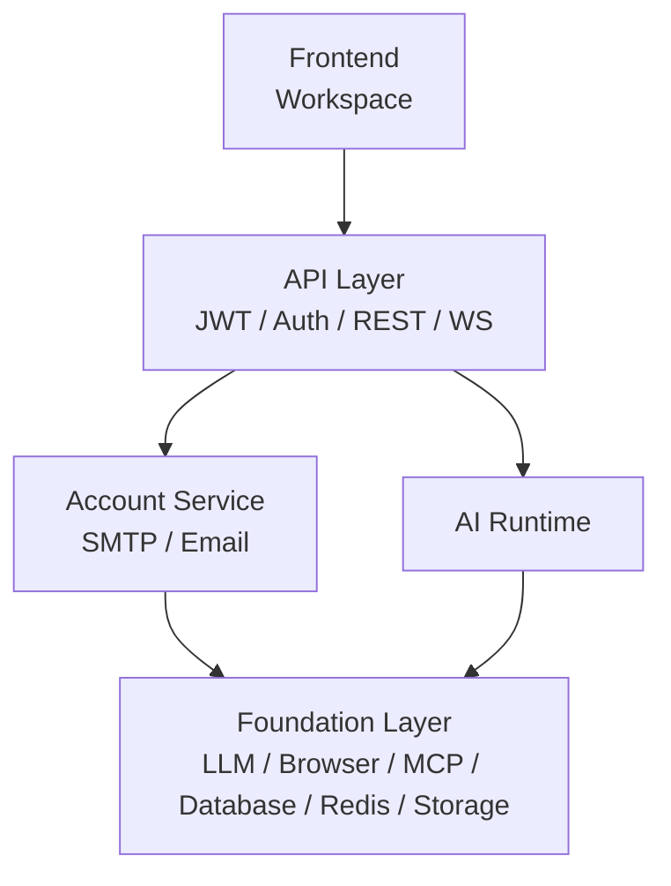

# AstraOS 主架构基线

更新时间：2026-07-14

本文档是 AstraOS 的主架构文档。它只定义长期稳定的产品定位、系统层级、Runtime 结构和实现边界。

## 1. 产品定位

```text
AstraOS 是一个 Enterprise AI Runtime。

AI Employee 是运行在 Runtime 上的业务应用。

Agent 是 Runtime 中负责决策的一部分，而不是整个系统。
```

AstraOS 的目标是完成 Task，而不是展示 Agent。

## 2. 主架构



系统分为四层：

```text
Frontend（Workspace）

API Layer（JWT / Auth / REST / WS）

AI Runtime

Foundation Layer（LLM / Browser / MCP / Database / Redis / Storage）
```

Account Service 是 API Layer 下的业务服务，负责账号、身份、邮箱验证和邮件发送。

## 3. Runtime 结构

```text
AI Runtime
  ├── Task Intake
  ├── Decision Engine
  ├── Planning（Optional）
  ├── Execution
  ├── Workflow（Optional Executor）
  ├── Tool
  ├── Context
  ├── Memory
  ├── Scheduler
  ├── Permission
  ├── Approval
  ├── Audit
  └── Result Delivery
```

Runtime 是 AstraOS 的核心执行平面。它负责把用户委托的 Task 可靠、可控、可恢复、可审计地完成。

## 4. Task 路径

```text
User
  -> Delegate Task
  -> Decision Engine
  -> Runtime Invocation
  -> Execution
  -> Result Delivery
```

当任务需要多步骤流程时，Execution 可以调用 Workflow executor：

```text
Task
  -> Decision
  -> Runtime
  -> Workflow（Optional）
  -> Tool（Optional）
  -> Result Delivery
```

Workflow 是执行方式之一，不是所有任务的必经路径。

## 5. Agent 定义

```text
Agent = Decision + Capability + Policy
```

- Decision：判断任务意图、路径、风险、结果标准。
- Capability：声明可用能力和可执行范围。
- Policy：约束权限、审批、风险和审计。

AI Employee 是 Agent 能力在 Workspace 中的产品化形态。

## 6. Runtime 模块职责

| 模块 | 职责 |
| --- | --- |
| Task Intake | 接收用户委托，创建 TaskRequest |
| Decision Engine | 判断直接回答、追问、工具动作、Workflow、权限和结果标准 |
| Planning（Optional） | 为多步骤或高风险任务生成用户可理解计划 |
| Execution | 执行 direct answer、clarification、tool action 或 workflow |
| Workflow（Optional Executor） | 执行需要多步骤编排的任务 |
| Tool | 受控读取、写入或外部动作 |
| Context | 按需装配 Workspace、附件、历史任务和业务对象 |
| Memory | 管理可复用上下文、偏好和长期记忆 |
| Scheduler | 管理异步任务、延迟任务、重试和恢复事件 |
| Permission | 约束本次 Task 可以读写什么 |
| Approval | 在高风险或不可逆动作前暂停并等待确认 |
| Audit | 记录决策、执行、暂停、恢复和副作用 |
| Result Delivery | 交付业务结果、失败原因和下一步建议 |

## 7. Foundation

```text
Foundation Layer
  ├── LLM
  ├── Browser
  ├── MCP
  ├── Database
  ├── Redis
  ├── Storage
  └── Queue
```

- LLM：模型调用和结构化输出。
- Browser：网页访问、自动化、截图和提取。
- MCP：外部工具和上下文协议。
- Database：账号、工作区、任务、Runtime 状态和审计记录。
- Redis：短期状态、锁、队列辅助和恢复事件。
- Storage：附件、文件和导出物。
- Queue：异步任务、重试、调度和后台执行。

## 8. 数据域

MVP 数据域：

```text
Account
Workspace
Employee
Task
Runtime
Marketplace
```

- Account：用户、邮箱验证、JWT、身份状态。
- Workspace：用户工作空间和项目容器。
- Employee：运行在 Runtime 上的业务应用配置。
- Task：用户委托、决策、权限、审批、结果。
- Runtime：执行、暂停、恢复、工具调用、审计。
- Marketplace：未来安装和分发 AI Employee。

## 9. 实现原则

- Workspace 是用户第一入口。
- Decision Engine 输出结构化决策。
- Runtime 只执行结构化 RuntimeInvocation。
- Permission、Approval、Audit 是 Runtime 默认能力。
- Tool 负责受控副作用。
- Result Delivery 是产品验收对象。
- Workflow 只在需要多步骤编排时出现。

## 10. MVP 实现顺序

1. Account 与 Workspace 基线。
2. TaskRequest / TaskDecision / RuntimeInvocation / TaskResult。
3. Direct answer 与 clarification。
4. ToolDefinition 与 ToolActionExecutor。
5. Permission / Approval pause-resume。
6. Audit。
7. Workflow executor。
