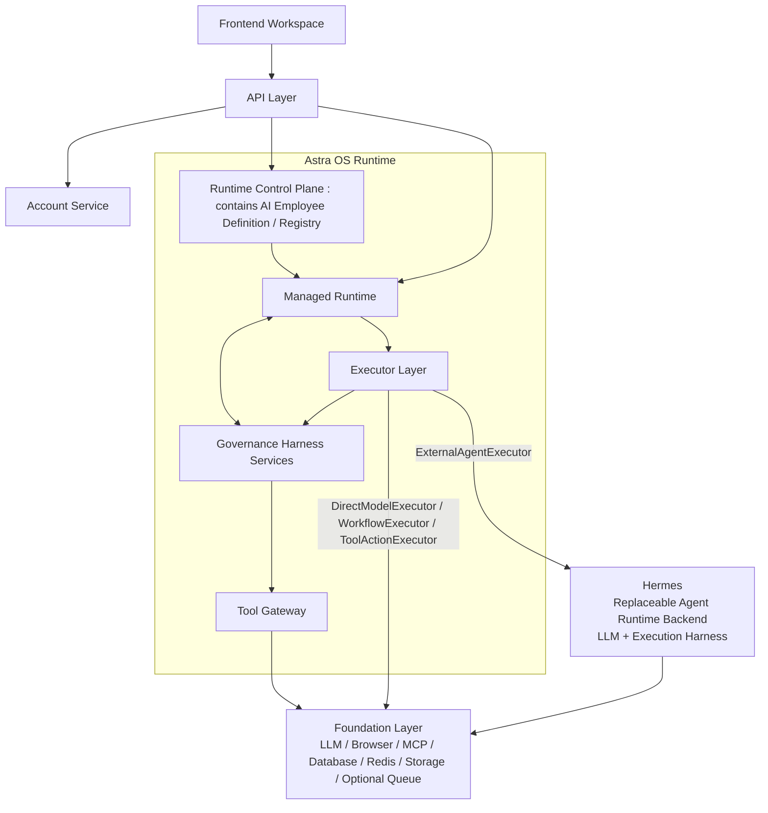

# AstraOS 主架构基线

更新时间：2026-07-16

本文档是 AstraOS 的主架构文档。它只定义长期稳定的产品定位、系统层级、控制面、托管运行时和执行器边界。

## 0. 实施范围标记

本文件中的架构边界长期有效，但“出现在架构中”不等于“当前已经实现”。具体实施时间和深度以 `MVP_SCOPE_AND_LONG_TERM_ROADMAP.md` 为唯一范围权威：

| 内容 | 范围标记 |
| --- | --- |
| 当前 Auth、单一 Workspace shell、双表数据基线 | `[CURRENT]` |
| Workspace / Presentation 产品边界 | `[MVP-P1]`、`[MVP-P2]` |
| Managed Runtime、Interaction、只读 Tool 最小纵向切片 | `[MVP-P3]` |
| 单级 Approval、幂等写操作、第一个 Customer Support Employee | `[MVP-P4]` |
| HumanExecutor、WorkflowExecutor、ExternalAgentExecutor 的长期分类和 Adapter 边界 | `[MVP-CONTRACT]` |
| External Agent / Hermes 真实 POC | `[POST-MVP-P5]` |
| Organization、Assignment Queue、多级审批、完整 RBAC / ABAC、平台化 Queue | `[DEFERRED]` |
| 自研模型执行型 Agent Harness | `[PROHIBITED]` |

产品 MVP Exit 为 Gate 4 accepted。HumanExecutor 在 MVP 内保留正式语义和接口，但真实人工分派、认领、执行与结果回收不属于 Gate 4 必选实现。

## 1. 产品定位

```text
AstraOS 是 Enterprise AI Operating System。

AI Employee 是由 AstraOS Control Plane 定义，并由 AstraOS Managed Runtime 托管运行的企业业务责任与治理对象。

Hermes 是可插拔 Agent Runtime / Executor Backend，不是 AstraOS 本体。

AstraOS 不自研模型执行型 Agent Harness。Hermes 等 Agent Runtime 负责模型决策循环、Executor-local Context、工具调用循环、Skills、Subagents、模型适配、Executor-local validation、retry 和 stop conditions。

AstraOS 实现 Governance Harness Services，负责 Context Envelope、Tool Gateway、Permission、Approval、Invocation Validation、Policy Enforcement、Idempotency Enforcement 和 Outcome Evidence Collection。

AstraOS Managed Runtime 负责持久任务生命周期、Interaction 持久化、Pause / Resume 协调、跨 Executor 路由与恢复、Reconciliation / Compensation、Direct Human Routing 和 Human Takeover。
```

AstraOS 的目标是完成 Task，而不是展示 Agent。

Agent Runtime 是 Executor 的一种。AI Employee 可以根据 Employee Execution Profile 为具体 Task 选择 Direct Model Runtime、Workflow Runtime、Agent Runtime 或 Human Executor。上述 Executor 可以通过 AstraOS Tool Gateway 调用当前 Task 允许使用的 Tools；Tool 不是与上述 Executor 并列的完整执行后端。

## 2. 主架构



系统主层级为：

```text
Frontend（Workspace）

API Layer
（JWT / Auth / REST / WebSocket / Organization / Marketplace API）

Astra OS Runtime
├── Runtime Control Plane
├── Governance Harness Services
├── Managed Runtime
└── Executor Layer
    ├── DirectModelExecutor
    ├── WorkflowExecutor
    ├── ExternalAgentExecutor
    ├── HumanExecutor
    └── ToolActionExecutor（单次 Tool 调用适配器）

External Agent Backends
└── Hermes
    └── LLM + Hermes Execution Harness

Foundation Layer
（LLM Gateway / Browser / MCP / Database / Redis / Storage / Queue（按需启用））
```

Account Service 是 API Layer 下的业务服务，负责账号、身份、邮箱验证和邮件发送。

## 3. 长期边界与 MVP 工程形态

本文档定义的是长期架构边界，不要求 MVP 第一版把所有边界实体化为独立服务、独立数据库对象、独立事件总线或完整企业级状态机。

MVP 的实现原则是：

```text
逻辑上完整分层。
工程上模块化单体。
```

也就是说，AstraOS 必须在代码和接口上保留 Control Plane、Governance Harness Services、Managed Runtime、Executor Layer、ExternalAgentExecutor、Interaction Runtime、Audit / Observability / Evaluation 等边界，但第一版应收敛为 API 内部的 Runtime Service 和一组 Executor Adapter。

MVP 推荐工程形态：

```text
API
└── Runtime Service
    ├── TaskDecision
    ├── Task State
    ├── Interaction
    ├── Governance Harness Services
    │   ├── Context Envelope
    │   ├── Tool Gateway
    │   ├── Permission / Approval
    │   ├── Invocation / Policy Validation
    │   ├── Idempotency Enforcement
    │   └── Outcome Evidence Collection
    ├── Executor Router
    └── Result Validation

Executors
├── Direct Model
├── Workflow
├── ExternalAgent
│   └── Hermes Adapter
├── Human
└── ToolAction（单次 Tool 调用适配器）
```

MVP 必须落地四类逻辑模块：

```text
Control Plane 配置
Governance 内部模块
Managed Runtime 核心
Executor Adapter
```

这里的“落地”不表示四类模块从第一个 Phase 起同时达到完整平台能力。Phase 3 先实现不可绕过的最低治理，包括 Tool 注册与 schema 校验、side-effect 分类、operation identity、默认拒绝写操作和基础 Audit；Phase 4 再补齐首个业务闭环所需的 Permission、单级 Approval、Idempotency、闭环 Audit 和场景级 reconciliation。Direct Human Routing 与 Human Takeover 在 MVP 内保留统一语义和 Adapter contract，不实现完整 Human Work assignment 流程。MVP 中 Governance 仍可作为 Runtime Service 内部模块存在，不提前拆成独立微服务或通用治理平台。

以下能力在 MVP 中只能作为内部模块、接口、枚举、状态字段或扩展点预留，不应提前平台化：

- 多个独立微服务。
- 分布式事件总线。
- 完整 Billing。
- 复杂 Checkpoint / Recovery。
- 多级审批链。
- 通用可视化 Workflow Builder。
- 多 Executor 智能负载路由。
- 完整企业 ABAC。
- 自研模型执行型 Agent Harness。

因此，架构思想上保留完整边界；工程实现上先完成最小 Task 闭环。禁止把长期架构图误读为 MVP 必须一次性实现完整平台。

## 4. 系统边界

```text
Control Plane：定义业务责任与治理规则
Governance Harness Services：管理执行边界
Managed Runtime：管理持久任务运行
Executor Backends：具体完成任务
Tools：由 Executor 通过 Tool Gateway 请求的受治理能力
```

AstraOS Control Plane 负责定义 AI Employee、Business Capability、Knowledge Scope、Tool Contract、Policy、Employee Execution Profile、Task Routing Configuration、Outcome Contract，以及 Model 和 Executor 配置。

Employee Execution Profile 的定义为：

```text
Employee Execution Profile
= Task Routing Configuration
+ Capability Requirements
+ Policy Constraints
+ Executor Preferences
```

Task Routing Configuration 只负责选择执行路径，不代表 Agent Runtime 内部的推理、规划或 ReAct 决策。

AstraOS Governance Harness Services 负责 Context Envelope、Tool Gateway、Permission / Approval、Invocation Validation、Policy Enforcement、Idempotency Enforcement 和 Outcome Evidence Collection。

AstraOS Managed Runtime 负责 Task 生命周期、Interaction 持久化、Pause / Resume 协调、跨 Executor 路由与恢复、Reconciliation / Compensation、Direct Human Routing、Human Takeover，以及 TaskResult 生成和交付。

逻辑执行形态包括：

```text
Executor
├── Direct Model Runtime
├── Workflow Runtime
├── Agent Runtime
└── Human Executor
```

Hermes 是可插拔 Agent Runtime / Executor Backend。Hermes Execution Harness 负责模型循环、Executor-local Context、工具调用循环、局部验证和纠正、模型适配、Skills、Subagents、Executor-local retry 和 stop conditions。

Human Executor 表示由人工承担实际业务执行、专业处理、监督或接管工作。它既可以由 TaskDecision 在任务开始时直接选择，也可以在其他 Executor 执行过程中通过重新决策选择：

```text
Direct Human Routing
  TaskDecision
    -> RuntimeInvocation(invocation_type = human)
    -> HumanExecutor

Human Takeover
  Existing Executor
    -> takeover intent / policy escalation
    -> 必要时 InteractionRequest(kind = takeover)
    -> new TaskDecision
    -> RuntimeInvocation(invocation_type = human)
    -> HumanExecutor
```

Direct Human Routing 不要求先发生自动执行、失败或 takeover Interaction。Human Takeover 表示任务原本由其他 Executor 承接，运行过程中因用户请求、Executor 请求、策略要求或不可恢复条件转交人工；只有需要用户选择或确认接管时，才必须创建 `InteractionRequest(kind = "takeover")`。

Approval 与 Human Executor 不等价。Approval 表示人工决定某个受治理动作是否允许继续，动作仍可由原 Tool / Workflow / Agent Executor 执行；只有人工取得实际任务执行责任时，才路由到 Human Executor。

Tool 是 Executor 通过 AstraOS Tool Gateway 请求的受治理能力，不与 Direct Model Runtime、Workflow Runtime、Agent Runtime 或 Human Executor 并列。现有 `ToolActionExecutor` 是封装单次受治理 Tool 调用的 Executor Adapter，不代表 Tool 本身是完整 Executor。

Queue 是按需启用的 Foundation 能力，可用于 Background Job、Retry、Resume Event 和 Delayed Task；长期也可服务于 `[DEFERRED]` 的人工任务分派。MVP 不要求部署独立 Queue；未启用 Queue 时仍必须通过持久化状态和受控调度满足恢复、幂等和审计要求。

Interaction Runtime / Presentation Contract 属于 Managed Runtime，是贯穿 Task 执行过程的横切能力，不是 Executor Backend 完成后的后置阶段。具体契约以 `TASK_PRESENTATION_CONTRACT.md` 为准。

外部 Executor 必须通过 Managed Runtime 的 Runtime Adapter 接入，并受 RuntimeInvocation、Context Envelope、ToolDefinition、Permission、Approval、Idempotency、Audit、Outcome Contract 和 TaskResult 约束。

Managed Runtime 不把 `RuntimeInvocation`、`ToolCall`、`WorkflowRun`、`StepRun`、Executor session 或 Hermes trace 作为 Workspace 主路径暴露。Workspace 只消费经过 Presentation Contract 映射后的 View Model。

## 5. Task 路径

```text
User
  -> Delegate Task
  -> Control Plane / Employee Execution Profile
  -> Task Routing Configuration
  -> Governance Harness Services
  -> Managed Runtime
  -> Runtime Adapter
  -> Selected Executor Backend
  <-> Allowed Tools through AstraOS Tool Gateway
  <-> Managed Runtime 持续接收 ExecutorEvent / Interaction Intent / Result Fragment
  <-> Interaction Runtime 按需暂停、请求用户参与、审批、恢复或取消
  -> TaskResult
```

Task 路径是调用关系，不改变结构归属：Control Plane 定义规则，Managed Runtime 管理每次运行，Executor Backend 具体完成任务。Executor Backend 可以在执行中随时产生交互意图；这些意图必须回到 Managed Runtime 内的 Interaction Runtime，由平台决定是否暂停、展示、审批、恢复或终止。

## 6. 禁止事项

- 禁止将 Governance Harness Services 在 MVP 中提前拆成多个独立服务。
- 禁止将 Context Envelope、Tool Gateway、Permission、Approval、Invocation Validation、Policy Enforcement、Idempotency Enforcement 或 Outcome Evidence Collection 下放为 Hermes 私有能力。
- 禁止把 Audit、Observability 和 Evaluation 混同为 Hermes Execution Harness 的内部能力。
- 禁止让外部 Agent Runtime 直接接收原始用户输入并绕过 RuntimeInvocation。
- 禁止让外部 Agent Runtime 直接写 AstraOS 业务表。
- 禁止让外部 Agent Runtime 自行决定高风险写入、外部动作或不可逆操作是否可执行。
- 禁止将外部 Agent Runtime 的 session、skill、tool trace、gateway 等内部对象暴露为 Workspace 主路径。
- 禁止让模型、Executor 或 Hermes 直接决定 Workspace 组件、布局、按钮、标题或最终 UI 文案。
- 禁止让 Frontend 直接消费 RuntimeInvocation、ToolCall、WorkflowRun、StepRun 等内部对象。
- 禁止将 Astra OS Managed Runtime 降级为 Hermes 等外部 runtime 的包装层。
- 禁止把长期架构边界在 MVP 中提前实现成多个独立微服务、分布式事件总线或完整企业平台。

## 7. 权威文档分工

- `ARCHITECTURE_BASELINE.md`：定义长期稳定的架构边界和禁止事项。
- `MVP_SCOPE_AND_LONG_TERM_ROADMAP.md`：定义当前、MVP、Post-MVP 和 Deferred 的唯一实施范围与深度。
- `TASK_PRESENTATION_CONTRACT.md`：定义 Runtime 执行语义到 Workspace 用户交互语义的承接链路、可见性边界、InteractionRequest / InteractionResponse 和 View Model 契约。
- `RUNTIME_REMEDIATION_SPEC.md`：定义 Managed Runtime 的工程契约、状态机、ToolDefinition、Permission、Approval、Audit、TaskResult 和 executor adapter。
- `PHASED_ENGINEERING_DELIVERY_PLAN.md`：定义分阶段交付顺序、POC 范围和验收标准。
- `WORKSPACE_VISUAL_BASELINE.md`：定义 Workspace 的用户体验边界，避免暴露 Runtime / Hermes 内部 trace。
