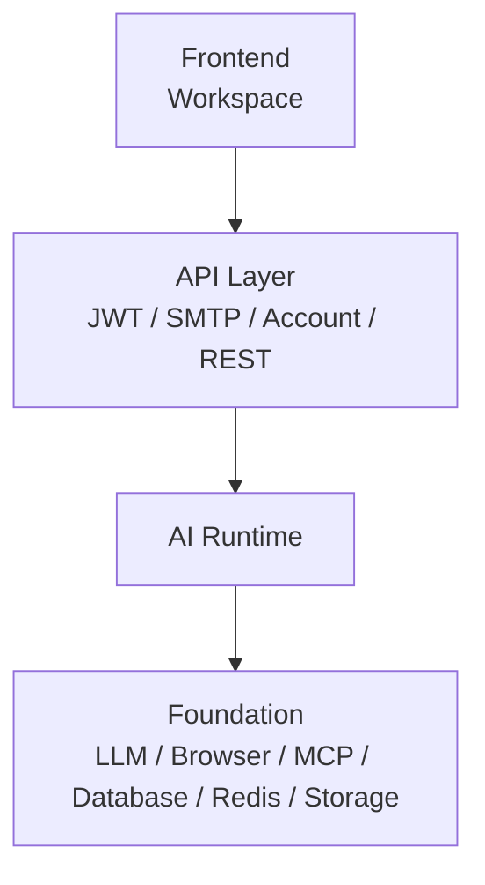

# AstraOS Runtime 整改规格

更新时间：2026-07-14

本文档定义 AstraOS AI Runtime 的工程整改要求。Runtime 的职责不是展示 Agent，也不是只执行 Workflow，而是把用户委托的 Task 可靠、可控、可恢复、可审计地完成。

## 1. Runtime 定位

```text
AstraOS 是一个 Enterprise AI Runtime。

AI Employee 是运行在 Runtime 上的业务应用。

Agent 是 Runtime 中负责决策的一部分，而不是整个系统。
```

核心判断：

```text
Decision Engine 决定 AI 应该做什么。
Runtime 决定 AI 能否可靠、可控、可恢复、可审计地把事情做完。
```

Workflow 是 Runtime 的一种可选 executor，不是 Runtime 的中心。

## 2. 总体架构



Runtime 内部结构：

```text
AI Runtime
  ├── Main Flow
  │   ├── Task Intake
  │   ├── Decision Engine
  │   ├── Planning（可选）
  │   ├── Execution
  │   └── TaskResult
  └── Supporting Capabilities
      ├── Context
      ├── Permission
      ├── Approval
      ├── Tool
      ├── Memory
      ├── Scheduler
      └── Audit
```

禁止将 Context、Permission、Approval、Audit 拆成 MVP 独立层或独立服务。它们是 Runtime 的默认能力。

## 3. 当前整改目标

Runtime 必须支持：

```text
创建 Task
  -> 结构化决策
  -> 进入 Runtime
  -> 直接回答 / 追问 / 工具动作 / 可选 Workflow
  -> 遇到审批或用户补充信息时暂停
  -> 记录恢复条件
  -> 收到事件后恢复
  -> 防止重复副作用
  -> 失败可追踪、可重试、可解释
  -> 交付 TaskResult 和 Audit
```

平台目标：

- Runtime 成为统一执行平面，不只是 API service 里的业务函数。
- Tool Definition 成为治理合同，不只是 Python 分支。
- Approval、Permission、Idempotency、Audit 成为 Runtime 默认能力。
- Workflow Definition 可以存在，但只能作为 Execution 下的可选 executor。

用户体验目标：

- Workspace 只展示任务、计划、权限、等待原因、审批和结果。
- 用户不需要理解 `AppRun`、`StepRun`、`ToolCall`。
- Console / Admin 只用于治理、观测、审计和调试。

## 4. 正确运行链路

```text
TaskRequest
  -> TaskDecision
  -> RuntimeInvocation
  -> RuntimeExecution
  -> ToolCall / WorkflowRun（可选）
  -> TaskResult
```

禁止链路：

```text
Task
  -> Workflow
  -> Runtime
```

原因：并非所有 Task 都需要 Workflow。例如翻译、总结、直接回答、澄清问题，都不应强制创建完整 Workflow Run。

## 5. Decision Engine 与 Runtime 的边界

| 模块 | 负责什么 | 不允许做什么 |
| --- | --- | --- |
| Decision Engine | 判断意图、路径、权限、审批、结果标准 | 直接写表、直接调用 Tool、修改 Runtime 状态 |
| Planning（可选） | 生成用户可理解、Runtime 可映射的计划 | 把内部 StepRun 原样暴露给用户 |
| Runtime | 执行、暂停、恢复、重试、超时、审计 | 依赖自由文本 prompt 判断下一步 |
| Tool | 受控读取、写入和外部动作 | 绕过权限、审批、幂等 |
| TaskResult | 判断 Task 是否真正完成并交付结果 | 用 Run 成功代替 Task 成功 |

耦合原则：

```text
Decision Engine 与 Runtime 通过 RuntimeInvocation / ToolDefinition / WorkflowDefinition / OutcomeSpec 耦合。

Decision Engine 与 Runtime 不通过 prompt 文本、业务分支代码或共享内部状态耦合。
```

## 6. RuntimeInvocation

进入 Runtime 的对象必须是 `RuntimeInvocation`，不能是原始用户 prompt 或未校验的模型自由文本。

```json
{
  "id": "uuid",
  "task_request_id": "uuid",
  "decision_id": "uuid",
  "task_id": "uuid",
  "workspace_id": "uuid",
  "selected_employee_id": "uuid",
  "invocation_type": "workflow",
  "tool_key": null,
  "workflow_template_key": "purchase_record_intake_v1",
  "input": {
    "ticket_id": "uuid",
    "attachment_ids": ["uuid"]
  },
  "context_bundle_id": "uuid",
  "permission_grant_ids": ["uuid"],
  "approval_requirements": [
    {
      "key": "confirm_purchase_record_before_write",
      "action": "create_purchase_record",
      "resource_type": "purchase_record",
      "required_before": "create_purchase_record"
    }
  ],
  "outcome_spec": {
    "desired_result": "Create a verified purchase record, asset, and reminder.",
    "success_criteria": [
      "purchase_record_created",
      "owned_asset_created",
      "applecare_reminder_created"
    ]
  },
  "created_at": "2026-07-14T12:00:00Z"
}
```

支持的 invocation：

| 类型 | Runtime 行为 |
| --- | --- |
| `direct_answer` | 生成轻量结果记录，不创建完整 Workflow Run |
| `clarification` | 进入等待用户补充信息状态 |
| `tool_action` | 执行单个受控 Tool，可按风险触发审批 |
| `workflow` | 创建 WorkflowRun / AppRun 并执行步骤 |

校验要求：

- `invocation_type = workflow` 时，`workflow_template_key` 必须存在且已注册。
- `invocation_type = tool_action` 时，`tool_key` 必须存在且已注册。
- `input` 必须通过对应 Tool 或 Workflow input schema 校验。
- `permission_grant_ids` 必须属于当前 Task / Workspace / User。
- `approval_requirements` 必须与 ToolDefinition 或 Workflow Step 的写操作匹配。
- `outcome_spec` 必须持久化到 Task / Runtime 记录中。

禁止：

- Runtime 根据 `raw_input` 临时猜测 workflow。
- Runtime 执行 Agent 返回的任意 tool name。
- Runtime 在缺少 permission grant 或 approval requirement 的情况下执行写操作。

## 7. Runtime 状态机

Runtime 对外状态：

```text
queued
running
waiting_for_user
waiting_for_approval
paused
succeeded
failed
cancelled
```

语义：

| 状态 | 含义 | 是否终态 |
| --- | --- | --- |
| `queued` | 已创建，等待执行 | 否 |
| `running` | 正在执行 | 否 |
| `waiting_for_user` | 等待用户补充信息或重新授权 | 否 |
| `waiting_for_approval` | 等待用户审批副作用动作 | 否 |
| `paused` | 系统或策略主动暂停 | 否 |
| `succeeded` | Runtime 本次执行完成 | 是 |
| `failed` | 执行失败且未自动恢复 | 是 |
| `cancelled` | 用户或系统取消 | 是 |

禁止：

- 用 `succeeded` 表达“已创建审批但还没完成任务”。
- 用 `skipped` 步骤代替 Runtime 等待态。
- 在等待用户审批时提前写入业务表。

## 8. Execution、Executor 与 Tool

Execution 是 Runtime 的执行模块。它可以选择不同 executor：

```text
Execution
  ├── DirectAnswerExecutor
  ├── ClarificationExecutor
  ├── ToolActionExecutor
  └── WorkflowExecutor（可选）
```

Executor 负责执行流程。Tool 是 executor 调用的受控资源，不是与 Execution 平级的流程。

调用关系：

```text
Execution
  -> Executor
  -> ToolDefinition / Domain Service / Foundation
```

WorkflowExecutor 只在任务确实需要多步骤流程时使用。ToolActionExecutor 可以执行单个受控 Tool。

Workflow Definition 要求：

- Step 必须是可执行定义，不只是展示步骤。
- Step 必须声明 executor、输入映射、权限、审批、幂等和失败策略。
- Workflow 不能绕过 ToolDefinition。
- Workflow 成功不等于 Task 成功，最终以 TaskResult 为准。

Step 状态：

```text
pending
running
waiting
succeeded
failed
skipped
```

等待态要求：

- `status = waiting` 时，必须写入 `resume_event_type`。
- 必须写入最小 `resume_payload`。
- 必须能解释等待原因。

## 9. Tool Definition

Tool 是 Runtime 的受控执行单元。所有业务写入必须通过 Tool 或 Domain Service，不允许 Agent / LLM 直接写表。

```json
{
  "tool_key": "create_purchase_record",
  "display_name": "Create Purchase Record",
  "provider": "builtin",
  "side_effect_level": "write",
  "required_permissions": ["create_purchase_record"],
  "requires_approval": true,
  "idempotency": {
    "required": true,
    "key_template": "approval:{approval_id}:create_purchase_record"
  },
  "timeout_seconds": 10,
  "retry_policy": {
    "max_attempts": 1
  },
  "input_schema": {},
  "output_schema": {}
}
```

副作用等级：

```text
none      不产生外部或业务副作用
read      只读取数据
draft     创建草稿或审批请求
write     写入业务记录
external  调用外部系统、发送邮件、支付、下单等
```

执行要求：

| 等级 | 是否需要权限 | 是否需要审批 | 是否需要幂等 |
| --- | --- | --- | --- |
| `none` | 否 | 否 | 否 |
| `read` | 是 | 视数据范围而定 | 否 |
| `draft` | 是 | 否 | 建议 |
| `write` | 是 | 是 | 是 |
| `external` | 是 | 是 | 是 |

## 10. Permission / Approval / Audit

Permission、Approval、Audit 是 Runtime 内部能力。

Permission 要求：

- 权限绑定到单个 Task。
- 写操作前必须检查权限。
- `denied_actions` 必须显式存在。
- 普通用户不看 policy key，但 UI 必须解释权限含义。

Approval 要求：

- 高风险写入、外部动作、不可逆操作前必须暂停。
- 审批卡片使用业务语言展示即将发生的动作。
- 用户批准后 Runtime resume。
- 用户拒绝后 Task 进入可解释失败或替代路径。

Audit 要求：

- 记录 Task 为什么这么决策。
- 记录 Runtime 为什么暂停、如何恢复。
- 记录 Tool 输入输出的脱敏快照。
- 记录副作用是否已经提交。

## 11. TaskResult

TaskResult 是产品验收对象，不是内部 Run Trace。

```ts
type TaskResult = {
  id: string;
  task_id: string;
  decision_id: string;
  status: "succeeded" | "partially_succeeded" | "failed" | "cancelled";
  result_type: string;
  summary: string;
  business_objects: BusinessObjectRef[];
  next_actions: string[];
  failure_reason: string | null;
  created_at: string;
};
```

要求：

- Runtime `succeeded` 不自动等于 TaskResult `succeeded`。
- Workspace 展示 TaskResult / Result，而不是展示 Run Trace。
- 失败结果必须说明原因和下一步建议。

## 12. Foundation 依赖

```text
Foundation
  ├── LLM
  ├── Browser
  ├── MCP
  ├── Database
  ├── Redis
  ├── Storage
  └── Queue
```

Runtime 不重新实现这些基础设施，只通过清晰接口使用它们。

Queue 主要负责 Background Job、Retry、Resume Event、Delayed Task。

## 13. MVP 实现顺序

1. TaskRequest / TaskDecision / RuntimeInvocation / TaskResult。
2. DirectAnswerExecutor。
3. ClarificationExecutor。
4. ToolDefinition + ToolActionExecutor。
5. Permission / Approval pause-resume。
6. Audit 记录。
7. WorkflowExecutor。

WorkflowExecutor 放在后面实现，避免 MVP 被 Workflow 复杂度拖慢。
