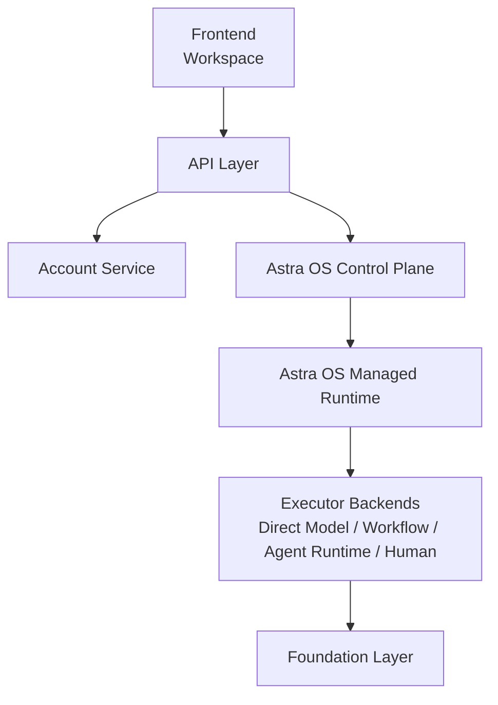

# AstraOS Runtime 整改规格

更新时间：2026-07-16

本文档定义 Astra OS Managed Runtime 与 Runtime Adapter 的工程整改要求。AstraOS 的职责不是展示 Agent，也不是只执行 Workflow，而是把用户委托的 Task 可靠、可控、可恢复、可审计地完成。

Runtime 执行语义到 Workspace 用户交互语义的承接链路以 `TASK_PRESENTATION_CONTRACT.md` 为准。本文档负责 Managed Runtime 的工程规格，并补充 Interaction Runtime 在执行、暂停、恢复、审批和审计中的落地要求。

## 0. 实施范围标记

本文档同时包含 MVP 必须实现的 Runtime 子集和长期完整工程契约。实施范围以 `MVP_SCOPE_AND_LONG_TERM_ROADMAP.md` 为准：

| Runtime 内容 | 范围标记 |
| --- | --- |
| Task / Interaction / TaskResult 语义和 Presentation 承接 | `[MVP-P1]`、`[MVP-P2]` 形成并冻结契约 |
| 持久 Task、追问恢复、DirectAnswer、Clarification、只读 Tool、最低 Audit | `[MVP-P3]` |
| 单级 Approval、Permission、Idempotent Write、闭环 Audit | `[MVP-P4]` |
| HumanExecutor invocation、Adapter、Direct Routing / Takeover 区分 | `[MVP-CONTRACT]` |
| ExternalAgentExecutor 真实接入 | `[POST-MVP-P5]` |
| Human Work assignment、Workflow production、独立 Queue、复杂恢复和通用补偿 | `[DEFERRED]` |

逻辑对象可以先作为内部类型、接口、状态字段或聚合的一部分存在，不要求一对象一表、一模块一服务。`RuntimeInvocation(invocation_type = human)` 的存在不表示 MVP 已经实现真实人工工作分派。

## 1. Runtime 定位

```text
AstraOS = Control Plane + Governance Harness Services + Managed Runtime + Executor Backends。

AI Employee 是由 AstraOS Control Plane 定义，并由 AstraOS Managed Runtime 托管运行的企业业务责任与治理对象。

Employee Execution Profile 通过 Task Routing Configuration 为当前 Task 选择和约束 Executor，不负责 Agent Runtime 内部的推理、规划或 ReAct 决策。

Hermes 是 Agent Runtime / Executor Backend 的一种，不是整个系统。
```

核心判断：

```text
AstraOS Control Plane 定义 AI Employee、Employee Execution Profile、资源、策略、结果合同和执行器配置。
AstraOS Governance Harness Services 管理 Context Envelope、Tool Gateway、Permission、Approval、Invocation Validation、Policy Enforcement、Idempotency Enforcement 和 Outcome Evidence Collection。
AstraOS Managed Runtime 管理持久任务、Interaction、Pause / Resume、跨 Executor 路由与恢复、Reconciliation / Compensation、Direct Human Routing、Human Takeover 和结果交付。
Hermes Agent Runtime 决定自主执行循环中的下一步行动，并通过其 Execution Harness 组织模型、Executor-local Context、工具请求和执行环境。
```

Employee Execution Profile 的定义为：

```text
Employee Execution Profile
= Task Routing Configuration
+ Capability Requirements
+ Policy Constraints
+ Executor Preferences
```

逻辑 Executor 类型包括：

```text
Executor
├── Direct Model Runtime
├── Workflow Runtime
├── Agent Runtime
└── Human Executor
```

Tool 不与上述 Executor 并列。Tool 是 Executor 通过 AstraOS Tool Gateway 请求的受治理能力；现有 ToolActionExecutor 是封装单次受治理 Tool 调用的 Executor Adapter。

Workflow Runtime 和 Agent Runtime 都是 Runtime Adapter 下的可选 Executor，不是系统中心。

本文档中的 Managed Runtime 不指 AstraOS 自研复杂 Agent Runtime 本体。AstraOS 不自研模型执行型 Agent Harness；Agent loop、长期技能学习、沙箱集群、多渠道网关、模型适配和模型路由等执行侧能力优先通过 Hermes 等外部 Executor Backend 或 Foundation 能力复用。

Hermes Execution Harness 负责 Agent loop、Prompt assembly、Executor-local model context、Tool calling loop、Skills / Subagents、Model adapter，以及 Executor-local validation、retry 和 stop conditions。

AstraOS Governance Harness Services 管理执行边界；Managed Runtime 管理持久任务、交互、恢复和跨 Executor 协调。Audit、Observability 和 Evaluation 是独立横切能力，不能简单等同于 Agent Harness 或 Managed Runtime 内部状态。

MVP 实现约束：

```text
长期边界完整保留。
第一版工程实现压成模块化单体。
```

Runtime Service 可以先作为 API 内部模块存在，而不是独立 runtime 微服务。Interaction、Permission、Approval、Audit、Result Validation 可以先作为 Runtime Service 内的子模块、接口、字段和最小状态流转实现；只有当真实业务复杂度要求时，才逐步拆成独立服务、独立事件流或更复杂的状态机。

Human Executor 是正式逻辑 Executor，既支持任务开始时的 Direct Human Routing，也支持其他 Executor 执行中的 Human Takeover。Approval 仍属于 Governance Harness Services：人工只批准一个由 Tool、Workflow 或 Agent 执行的动作时，不产生 `human` invocation；只有人工取得实际任务执行责任时，才路由到 Human Executor。

MVP 与长期扩展共同遵守的逻辑结构：

```text
API
└── Runtime Service
    ├── TaskDecision
    ├── Task State
    ├── Interaction
    ├── Permission / Approval
    ├── Executor Router
    └── Result Validation

Executors
├── Direct Model
├── Workflow
├── ExternalAgent
│   └── Hermes Adapter
├── Human
└── ToolAction（单次 Tool 调用适配器）
```

MVP 不做：

- 多个独立微服务。
- 分布式事件总线。
- 完整 Billing。
- 复杂 Checkpoint。
- 多级审批链。
- 通用可视化 Workflow Builder。
- 多 Executor 智能负载路由。
- 完整企业 ABAC。
- 自研模型执行型 Agent Harness。

## 2. Runtime 架构上下文

系统总体架构以 `ARCHITECTURE_BASELINE.md` 为准。本文档只定义 `Astra OS Managed Runtime / Runtime Adapter`
这一层的工程整改要求，不能覆盖或改写主架构基线。



Spec 架构结构：

```
Astra OS
├── Control Plane
│   ├── AI App / AI Employee
│   ├── Employee Execution Profile
│   ├── Business Capability / Outcome Contract
│   ├── Workflow Definition
│   ├── Tool / Knowledge / Credential Registry
│   ├── RBAC / Policy
│   ├── Approval Rules
│   └── Executor / Model Configuration
│
├── Governance Harness Services
│   ├── Context Envelope
│   ├── Tool Gateway
│   ├── Permission / Approval
│   ├── Invocation / Policy Validation
│   ├── Idempotency Enforcement
│   └── Outcome Evidence Collection
│
├── Managed Runtime
│   ├── Task Intake
│   ├── Task / AppRun State Machine
│   ├── Workflow Orchestration
│   ├── Interaction Runtime
│   │   └── Presentation Contract
│   ├── Governance Service Coordination
│   ├── Executor Routing
│   ├── Retry / Timeout / Cancel
│   ├── Checkpoint / Recovery
│   ├── Result Delivery
│   └── Runtime Adapter
│
└── Executor Backends
    └── Hermes Executor
        ├── Execution Harness（Hermes 自带，AstraOS 不自研模型执行型 Harness）
        │   ├── Prompt / Instruction Assembly
        │   ├── Context Management
        │   ├── Model Adapter
        │   ├── Capability Contract
        │   ├── Agent Loop
        │   ├── Planning
        │   ├── Tool Calling / MCP
        │   ├── Memory / Skills
        │   ├── Subagents
        │   ├── Observation / Feedback
        │   ├── Local Retry / Stop Conditions
        │   └── Output Validation
        │
        └── Execution Environment
            ├── Docker Sandbox
            ├── SSH Backend
            ├── Modal Backend
            ├── Browser Environment
            └── Filesystem / Terminal
```

禁止将 Governance Harness Services 在 MVP 中提前拆成多个独立服务。它们可以先作为 Runtime Service 内部模块实现，但不能被下放为 Hermes 私有能力。Audit、Observability 和 Evaluation 保持独立的横切职责，也不要求 MVP 立即平台化。

Hermes Execution Harness 不包含：

- User / Organization / Project。
- 企业 RBAC。
- 业务审批。
- Billing。
- 全局 Task 状态机。
- 前端 Presentation Contract。
- 企业审计。
- AI App 生命周期。
- Workflow 版本管理。
- 跨任务队列调度。
- 等待用户输入数小时后的恢复。

这些是 AstraOS Control Plane、Governance Harness Services、Managed Runtime 或独立治理系统的职责。Hermes Execution Harness 只处理单次执行内贴近模型、Executor-local Context、工具请求和执行环境的能力。

Harness 归属标记：

```text
Hermes Executor
└── Execution Harness（Hermes 内部能力）

AstraOS Governance Harness Services
└── 执行边界治理

AstraOS Managed Runtime
└── 持久任务、Interaction、恢复与跨 Executor 协调
```

AstraOS 不实现模型执行型 Agent Harness，不维护自己的 Agent loop、Executor-local 模型上下文压缩、工具调用循环、Subagents 或 Skills 学习系统。

## 3. 当前整改目标

Astra OS Managed Runtime 必须支持：

```text
创建 Task
  -> 结构化决策
  -> 进入 Runtime Adapter
  -> 直接回答 / 追问 / 工具动作 / 可选 Workflow
  -> 遇到审批或用户补充信息时暂停
  -> 记录恢复条件
  -> 收到事件后恢复
  -> 防止重复副作用
  -> 失败可追踪、可重试、可解释
  -> 交付 TaskResult 和 Audit
```

平台目标：

- Astra OS Managed Runtime 成为统一运行管理层，不只是 API service 里的业务函数。
- Interaction Runtime 成为任务暂停、用户补充、审批确认、人工接管和恢复执行的统一承接层。
- Tool Definition 成为治理合同，不只是 Python 分支。
- Permission、Approval、Invocation Validation、Policy Enforcement、Idempotency Enforcement 和 Outcome Evidence Collection 成为 Governance Harness Services 的默认能力。
- Audit、Observability 和 Evaluation 作为独立横切能力与 Task、Runtime 和 Executor 建立稳定关联。
- Workflow Definition 可以存在，但只能作为 Runtime Adapter 下的可选 executor。
- MVP 阶段这些能力先在 Runtime Service 内模块化实现，不要求拆成独立服务或完整平台能力。

用户体验目标：

- Workspace 只展示任务、计划、权限、等待原因、审批和结果。
- 用户不需要理解 `AppRun`、`StepRun`、`ToolCall`。
- Console / Admin 只用于治理、观测、审计和调试。

## 4. 正确运行链路

```text
TaskRequest
  -> TaskDecision
  -> RuntimeInvocation
  -> Runtime Adapter
  -> Executor Backend（Direct Model / Workflow / Agent Runtime / Human，或单次 ToolAction Adapter）
  <-> ExecutorEvent / ToolRequest / Interaction Intent / Result Fragment
  <-> Interaction Runtime（需要用户参与时暂停、审批、补充信息、授权、接管或恢复）
  -> Runtime Resume / Control Event（需要继续执行时）
  -> TaskResult
```

禁止链路：

```text
Task
  -> Workflow
  -> Runtime
```

原因：并非所有 Task 都需要 Workflow。例如翻译、总结、直接回答、澄清问题，都不应强制创建完整 Workflow Run。

TaskDecision 不是传统意图识别里的永久标签，而是当前时刻的结构化路由决定。它必须基于用户目标、上下文完整度、Employee 能力、ToolDefinition、Permission、Approval、Executor Capability、WorkflowDefinition 和 outcome_spec 共同生成。

同一个 Task 可以在运行过程中产生新的路由决定：

```text
ask_clarification
  -> 用户补充信息
  -> start_workflow

external_agent
  -> Agent 发现需要单次受控写入
  -> execute_tool
  -> 回到 external_agent
```

因此 AstraOS 不是语义库匹配器，而是面向执行形态和治理约束的任务路由系统。TaskDecision 必须可审计、可解释、可重新决策；每次重新决策都必须生成新的 RuntimeInvocation 或受控 resume / control 事件，不能让模型、Frontend、Executor 或 Hermes 通过自由文本改变执行路径。

MVP 中，这条链路可以由一个 Runtime Service 在单进程内完成。`TaskDecision`、`RuntimeInvocation`、`InteractionRequest`、`Approval`、`Audit` 和 `TaskResult` 必须作为清晰的内部对象或 contract 出现，但不要求每个对象都有独立数据库表、独立队列或独立服务。

## 5. Control Plane、Managed Runtime 与 Executor 的边界

| 模块 | 负责什么 | 不允许做什么 |
| --- | --- | --- |
| Control Plane / Decision | 定义 Employee 能力、策略、权限、审批规则和结果标准 | 直接写表、直接调用 Tool、修改运行状态 |
| Planning（可选） | 生成用户可理解、Runtime Adapter 可映射的计划 | 把内部 StepRun 原样暴露给用户 |
| Astra OS Managed Runtime | 状态机、治理服务协调、审批等待与恢复、结果验收 | 接管 Permission / Approval / Idempotency / Audit 的主权，或把运行控制权交给 Hermes 私有 session / trace |
| Runtime Adapter / Executor | 执行、暂停、恢复、重试、超时、归一化事件 | 依赖自由文本 prompt 判断下一步或绕过 Managed Runtime |
| Tool | 受控读取、写入和外部动作 | 绕过权限、审批、幂等 |
| TaskResult | 判断 Task 是否真正完成并交付结果 | 用 Run 成功代替 Task 成功 |

耦合原则：

```text
Decision Engine 与 Runtime Adapter 通过 RuntimeInvocation / ToolDefinition / WorkflowDefinition / OutcomeSpec 耦合。

Decision Engine 与 Runtime Adapter 不通过 prompt 文本、业务分支代码或共享内部状态耦合。
```

## 6. RuntimeInvocation

进入 Runtime Adapter 的对象必须是 `RuntimeInvocation`，不能是原始用户 prompt 或未校验的模型自由文本。

```json
{
  "id": "uuid",
  "task_request_id": "uuid",
  "decision_id": "uuid",
  "task_id": "uuid",
  "workspace_id": "uuid",
  "selected_employee_id": "uuid",
  "invocation_type": "workflow",
  "tool_key": null,
  "workflow_template_key": "purchase_record_intake_v1",
  "input": {
    "ticket_id": "uuid",
    "attachment_ids": ["uuid"]
  },
  "context_bundle_id": "uuid",
  "permission_grant_ids": ["uuid"],
  "approval_requirements": [
    {
      "key": "confirm_purchase_record_before_write",
      "action": "create_purchase_record",
      "resource_type": "purchase_record",
      "required_before": "create_purchase_record"
    }
  ],
  "outcome_spec": {
    "desired_result": "Create a verified purchase record, asset, and reminder.",
    "success_criteria": [
      "purchase_record_created",
      "owned_asset_created",
      "applecare_reminder_created"
    ]
  },
  "created_at": "2026-07-14T12:00:00Z"
}
```

支持的 invocation：

| 类型 | Runtime 行为 |
| --- | --- |
| `direct_answer` | 生成轻量结果记录，不创建完整 Workflow Run |
| `clarification` | 进入等待用户补充信息状态 |
| `tool_action` | 执行单个受控 Tool，可按风险触发审批 |
| `workflow` | 创建 WorkflowRun / AppRun 并执行步骤 |
| `external_agent` | 通过 ExternalAgentExecutor 启动受控外部 Agent Runtime 执行；MVP production 默认关闭 |
| `human` | 创建受治理的 Human Work Item，由 HumanExecutor 承接直接人工执行、专业处理、监督或接管 |

校验要求：

- `invocation_type = workflow` 时，`workflow_template_key` 必须存在且已注册。
- `invocation_type = tool_action` 时，`tool_key` 必须存在且已注册。
- `invocation_type = external_agent` 时，必须选择已注册且通过 capability / policy 校验的 ExternalAgentExecutor backend。
- `invocation_type = human` 时，必须指定已注册的 HumanExecutor、所需人工角色、assignment policy、允许动作、可见上下文和 outcome_spec。
- `input` 必须通过对应 invocation 的 input schema 校验；Tool、Workflow、External Agent 和 Human Work 分别使用各自已注册的契约。
- `permission_grant_ids` 必须属于当前 Task / Workspace / User。
- `approval_requirements` 必须与 ToolDefinition 或 Workflow Step 的写操作匹配。
- `outcome_spec` 必须持久化到 Task / Runtime 记录中。

禁止：

- Runtime Adapter 根据 `raw_input` 临时猜测 workflow。
- Runtime Adapter 执行 Agent 返回的任意 tool name。
- Runtime Adapter 在缺少 permission grant 或 approval requirement 的情况下执行写操作。

Human 路由要求：

```text
Direct Human Routing
  TaskRequest
    -> TaskDecision(selected_executor = human_executor)
    -> RuntimeInvocation(invocation_type = human)
    -> HumanExecutor

Human Takeover
  Existing Executor
    -> takeover intent / policy escalation
    -> 需要用户参与时创建 InteractionRequest(kind = takeover)
    -> new TaskDecision(selected_executor = human_executor)
    -> RuntimeInvocation(invocation_type = human)
    -> HumanExecutor
```

- Direct Human Routing 可以由政策、受监管角色要求、用户明确选择或自动能力缺失触发，不要求存在先前 Executor、失败事件或 takeover Interaction。
- Human Takeover 表示原本由其他 Executor 承接的 Task 在运行中升级给人工；新的 TaskDecision 必须记录 `routing_mode = takeover`、`reason_code` 和 `source_invocation_id`。
- 如果策略可以自动决定升级，不需要用户选择或确认，则可以直接重新决策，不得为了形式完整而创建没有用户动作的 InteractionRequest。
- Approval 只改变受治理动作是否允许继续；若动作仍由原 Executor 执行，则不得改写为 `invocation_type = human`。

## 7. Runtime 状态机

Runtime 对外状态：

```text
queued
running
waiting_for_user
waiting_for_approval
paused
succeeded
failed
cancelled
```

语义：

| 状态 | 含义 | 是否终态 |
| --- | --- | --- |
| `queued` | 已创建，等待执行 | 否 |
| `running` | 正在执行 | 否 |
| `waiting_for_user` | 等待用户补充信息或重新授权 | 否 |
| `waiting_for_approval` | 等待用户审批副作用动作 | 否 |
| `paused` | 系统或策略主动暂停 | 否 |
| `succeeded` | Runtime 本次执行完成 | 是 |
| `failed` | 执行失败且未自动恢复 | 是 |
| `cancelled` | 用户或系统取消 | 是 |

禁止：

- 用 `succeeded` 表达“已创建审批但还没完成任务”。
- 用 `skipped` 步骤代替 Runtime 等待态。
- 在等待用户审批时提前写入业务表。

## 8. Interaction Runtime

Interaction Runtime 是 Astra OS Managed Runtime 内部模块，负责把执行侧事件转换为可持久化、可恢复、可审计的用户交互请求。它是贯穿任务生命周期的横切能力，不是 Hermes、Tool、Workflow 或 Browser 执行完成之后的固定后置阶段。

Executor Backend 可以在执行中随时发出缺信息、审批、授权、错误恢复或人工接管等 `Interaction Intent`。Managed Runtime 必须接收这些意图；需要用户参与时创建 `InteractionRequest`，必要时暂停对应运行，并在用户响应、审批结果或恢复事件到达后，通过受控 `Runtime Resume Event` / `ExecutorControl` 恢复、终止或重新路由执行。策略能够自动决定的人工升级不创建无用户动作的 InteractionRequest，而是直接产生新的 TaskDecision 和 `RuntimeInvocation(invocation_type = human)`。

它不负责渲染 UI，也不负责执行 Tool。它负责维护：

```text
Interaction Intent
  -> 需要用户参与？
      ├── 是：InteractionRequest
      │     -> Workspace View Model
      │     -> InteractionResponse
      │     -> Runtime Resume / Re-decision Event
      └── 否：TaskDecision / Runtime Control Event
```

### 8.1 InteractionRequest

每个等待用户动作都必须创建 `InteractionRequest`。

```ts
type InteractionKind =
  | "input"
  | "selection"
  | "confirmation"
  | "approval"
  | "result"
  | "takeover"
  | "progress"
  | "error_recovery"
  | "file_request"
  | "authentication";

type InteractionAction =
  | "submit"
  | "select"
  | "approve"
  | "reject"
  | "edit"
  | "takeover"
  | "cancel";

type InteractionRequest = {
  id: string;
  taskId: string;
  runId: string | null;
  stepId: string | null;
  kind: InteractionKind;
  status: "pending" | "submitted" | "resolved" | "cancelled" | "expired";
  blocking: boolean;
  schema: Record<string, unknown> | null;
  payload: Record<string, unknown>;
  actions: InteractionAction[];
  riskLevel: "none" | "low" | "medium" | "high";
  visibility: "user_visible" | "summarized" | "internal_only";
  presentationHint: "inline" | "modal" | "side_panel" | "full_screen" | null;
  reasonCode: string;
  createdAt: string;
  expiresAt: string | null;
};
```

要求：

- `blocking = true` 时，Runtime 必须进入 `waiting_for_user`、`waiting_for_approval` 或 `paused`。
- `visibility = internal_only` 的 InteractionRequest 不能进入普通 Workspace View Model。
- `schema` 必须足以校验用户提交数据。
- `reasonCode` 必须能映射到确定性文案模板和审计说明。
- `payload` 不得包含 token、cookie、raw prompt、chain-of-thought、DOM selector、stack trace 或未脱敏 Tool 参数。

### 8.2 InteractionResponse

用户提交后必须持久化 `InteractionResponse`。

```ts
type InteractionResponse = {
  id: string;
  interactionId: string;
  taskId: string;
  userId: string;
  action: InteractionAction;
  data: Record<string, unknown>;
  submittedAt: string;
};
```

要求：

- `interactionId` 必须指向同一 Task 下未终结的 InteractionRequest。
- `data` 必须通过 `schema` 校验。
- `approve` 必须重新校验权限、审批要求、风险等级、过期时间和幂等键。
- `reject`、`cancel`、`expired` 必须进入可解释失败、替代路径或取消状态。
- Runtime resume 必须幂等，不能重复提交写入、下单、发邮件、支付等副作用。

### 8.3 可见性边界

Runtime 内部事件进入 Workspace 前必须经过可见性分类：

```text
user_visible      可以进入 Workspace
summarized        只能被转成用户语言
internal_only     只能留在 Runtime / Console / Audit
```

禁止普通 Workspace API 返回：

```text
RuntimeInvocation 原始对象
ToolCall 原始参数
WorkflowRun / StepRun
Executor session
Browser DOM selector
模型 chain-of-thought
raw prompt
MCP trace
cookie / token
内部策略规则
idempotency key
stack trace
```

### 8.4 Model Non-Presentation Rule

模型和 Executor 只能输出受约束的语义候选或 Interaction Intent，不能决定 UI。

允许：

```json
{
  "intent": "request_user_input",
  "reason_code": "missing_required_fields",
  "fields": ["destination", "date"]
}
```

禁止：

```text
请打开 FlightSearchForm，标题写“请填写航班信息”，按钮叫“开始搜索”。
```

标题、按钮、风险说明、错误提示和审批模板必须由 `reasonCode -> deterministic copy template -> i18n label` 生成。

## 9. Runtime Adapter、Executor 与 Tool

Runtime Adapter 是 Astra OS Managed Runtime 连接执行后端的适配模块。它可以选择不同 executor：

```text
Runtime Adapter
  ├── DirectAnswerExecutor
  ├── ClarificationExecutor
  ├── ToolActionExecutor
  ├── ExternalAgentExecutor（可选适配器）
  ├── WorkflowExecutor（可选）
  └── HumanExecutor
```

Executor 负责执行流程。Tool 是 executor 调用的受控资源，不是与 Runtime Adapter 平级的流程。

逻辑分类为：

```text
Executor
├── Direct Model Runtime
├── Workflow Runtime
├── Agent Runtime
└── Human Executor

Tool
└── 由 Executor 通过 AstraOS Tool Gateway 调用
```

现有工程对象的映射关系：

| 工程对象 | 逻辑定位 |
| --- | --- |
| DirectAnswerExecutor | Direct Model Runtime Adapter |
| ClarificationExecutor | Interaction / Waiting State Adapter |
| WorkflowExecutor | Workflow Runtime Adapter |
| ExternalAgentExecutor | Agent Runtime Adapter |
| HumanExecutor | Human Executor Adapter |
| ToolActionExecutor | 单次受治理 Tool 调用 Adapter |
| ToolDefinition | Tool 治理合同 |
| Tool | Executor 可以请求的受治理能力 |

因此，ToolActionExecutor 可以继续保留，但不得据此将 Tool 定义为与 Agent Runtime 或 Workflow Runtime 并列的完整 Executor。

调用关系：

```text
Runtime Adapter
  -> Executor
  -> ToolDefinition / Domain Service / Foundation
```

WorkflowExecutor 只在任务确实需要确定性多步骤流程时使用。ToolActionExecutor 可以封装单个受控 Tool 调用。

ExternalAgentExecutor 用于接入 Hermes 等外部 Agent Runtime。它是 executor adapter，不是 Astra OS Managed Runtime 的替代品，也不是 AstraOS 自研的复杂 runtime 本体。

当后端是 Hermes 时，ExternalAgentExecutor 接入的是 Hermes Execution Harness 对外暴露的受控 executor 接口；它不进入、不复制、不依赖 Hermes Execution Harness 的内部 loop、prompt、memory 或 trace。

调用关系：

```text
RuntimeInvocation
  -> Runtime Adapter
  -> ExternalAgentExecutor
  -> External Agent Runtime（Hermes / Future Backend）
  <-> ExecutorEvent / ToolRequest / Interaction Intent / ExecutorResult
  <-> AstraOS ToolAction / Permission / Approval / Interaction Runtime / Idempotency / Audit
  <-> ExecutorControl(tool_result / interaction_response / resume / cancel)
  <-> External Agent Runtime 继续执行或终止
  -> candidate_result
  -> AstraOS outcome_spec 验收
  -> TaskResult
```

ExternalAgentExecutor 的职责：

- 将 RuntimeInvocation 转换为外部 Agent Runtime 可理解的受控任务输入。
- 只传递 ContextBundle 中被允许的上下文，不传递整个 Workspace 数据。
- 将外部 Agent Runtime 的工具调用意图转换为 AstraOS ToolRequest。
- 在 AstraOS 完成工具执行后，将 ToolResult 通过 ExecutorControl 或等价受控通道回传给外部 Agent Runtime。
- 在写入、外部动作、不可逆动作前交回 AstraOS Permission / Approval 判断。
- 将外部执行日志、失败原因、候选结果归一化为 ExecutorEvent / ExecutorResult。
- 由 AstraOS 生成最终 TaskResult，而不是直接采用外部 Agent Runtime 的最终文本。
- 平台级 Schedule Trigger 由 AstraOS 管理；Hermes 只处理单次执行内部的 timers、long-running step 和后台等待。

ExternalAgentExecutor 禁止：

- 直接把用户原始 prompt 交给 Hermes 等外部 runtime 执行。
- 接受外部 runtime 返回的任意 tool name 并直接执行。
- 让外部 runtime 绕过 ToolDefinition、Permission、Approval、Idempotency。
- 让外部 runtime 直接连接或写入 AstraOS 主业务数据库。
- 将外部 runtime 的 session、skill、memory、gateway、trace 作为 Workspace 产品对象暴露。
- 依赖外部 runtime 的自学习结果自动改变 Employee 权限或 ToolDefinition。

### 9.1 Executor 接口命名

Runtime Adapter 与外部执行后端之间必须使用稳定的 executor 接口对象，不能依赖 Hermes 私有 session、trace 或自由文本协议。

标准接口命名：

```text
ExecutorRequest
ExecutorEvent
ExecutorResult
ExecutorCapability
ExecutorControl
```

含义：

| 名称 | 方向 | 用途 |
| --- | --- | --- |
| `ExecutorRequest` | Runtime Adapter -> Executor | 承载由 `RuntimeInvocation` 派生的受控执行输入、裁剪后的上下文、允许工具、审批策略和结果标准。 |
| `ExecutorEvent` | Executor -> Runtime Adapter | 流式返回进度、工具请求、交互意图、候选结果、失败和诊断摘要。 |
| `ExecutorResult` | Executor -> Runtime Adapter | 返回单次执行的候选结果、使用摘要和结束原因；它不是最终 `TaskResult`。 |
| `ExecutorCapability` | Executor -> Runtime Adapter | 声明执行后端支持的执行能力，用于路由、降级和安全校验。 |
| `ExecutorControl` | Runtime Adapter -> Executor | 发送 cancel、pause、resume、abort、heartbeat、tool_result 等受控命令。 |

参考接口：

```ts
interface ExecutorBackend {
  start(request: ExecutorRequest): Promise<{ executionId: string }>;
  sendControl(executionId: string, command: ExecutorControl): Promise<void>;
  streamEvents(executionId: string): AsyncIterable<ExecutorEvent>;
  cancel(executionId: string): Promise<void>;
}
```

命名要求：

- `RuntimeInvocation` 是 AstraOS 内部进入 Runtime Adapter 的标准对象。
- `ExecutorRequest` 是 Runtime Adapter 发给具体 executor backend 的标准对象。
- `ExternalAgentInvocation` 如继续存在，只能作为 `ExecutorRequest` 的 Hermes POC 兼容别名或实现细节。
- `ExecutorEvent` 可以承载 `tool_request`、`interaction_intent`、`candidate_result`、`progress` 和 `failed`。
- `needs_context` 等外部执行事件不能直接进入前端，必须先由 Runtime Adapter 转换为 AstraOS 统一的 `InteractionRequest`，再通过 Presentation Contract 映射为 Workspace View Model。
- `ExecutorControl` 必须能承载 AstraOS 工具执行后的 `tool_result`，供外部 Agent Runtime 继续执行。
- `ExecutorResult` 必须经过 AstraOS outcome_spec 验收后，才能生成最终 `TaskResult`。

### 9.2 Capability Contract 分层

Capability Contract 必须分为两层，不能把 Executor 能力和模型能力混成一个合同。

#### Executor Capability

`ExecutorCapability` 属于：

```text
Runtime Adapter ↔ Executor Backend
```

它描述执行后端能否承接某类任务，以及 Runtime 是否需要路由、降级或提前请求用户参与。

示例：

```json
{
  "backend": "hermes",
  "supports_tool_calling": true,
  "supports_browser": true,
  "supports_subagents": true,
  "supports_pause_resume": false,
  "supports_streaming": true,
  "supports_sandbox": true,
  "supports_interaction_intent": true,
  "supports_redacted_trace": true,
  "supports_supervised_browser": true,
  "supports_auth_handoff": true,
  "supports_structured_result": true
}
```

Executor Capability 只能用于 Runtime 路由和治理判断，不能代替 ToolDefinition、Permission、Approval 或 outcome_spec。

#### Model Capability

`ModelCapability` 属于：

```text
Agent Harness / Model Adapter ↔ Model
```

它描述某个模型的原生能力和限制，由 Hermes Harness 或 Foundation Model Adapter 管理。

示例：

```json
{
  "provider": "example",
  "model": "example-reasoning-model",
  "supports_tools": true,
  "supports_streaming": true,
  "supports_vision": true,
  "supports_parallel_tool_calls": false,
  "supports_json_schema": true,
  "supports_system_prompt": true,
  "max_input_tokens": 128000,
  "max_output_tokens": 8192,
  "tool_call_format": "openai",
  "reasoning_mode": "native"
}
```

Model Capability 可以影响 executor 内部的模型选择、prompt 组装、工具调用格式和结构化输出策略，但不能直接决定 AstraOS 任务是否允许执行、是否需要审批、是否可以写入业务系统。

Hermes 模型适配边界：

- Hermes 可以统一不同模型的请求字段、响应字段、tool call 格式、streaming chunk、错误码和重试包装。
- Hermes 可以对上层暴露统一 `run` 接口，并在 Harness 内部通过 Model Capability 声明模型能力。
- 模型接入 API key 和 adapter 只代表可以发请求，不代表可直接用于所有任务。
- 模型必须声明是否支持 tools、streaming、vision、JSON schema、system prompt、上下文长度、最大输出和 reasoning mode。
- 新模型必须通过 smoke test / eval 后才进入可用模型列表。
- Hermes 不能消除模型能力、推理质量、工具调用稳定性、JSON 遵循能力、延迟和成本差异。

Workflow Definition 要求：

- Step 必须是可执行定义，不只是展示步骤。
- Step 必须声明 executor、输入映射、权限、审批、幂等和失败策略。
- Workflow 不能绕过 ToolDefinition。
- Workflow 成功不等于 Task 成功，最终以 TaskResult 为准。

Step 状态：

```text
pending
running
waiting
succeeded
failed
skipped
```

等待态要求：

- `status = waiting` 时，必须写入 `resume_event_type`。
- 必须写入最小 `resume_payload`。
- 必须能解释等待原因。

## 10. Tool Definition

Tool 是 Runtime 的受控执行单元。所有业务写入必须通过 Tool 或 Domain Service，不允许 Agent / LLM 直接写表。

```json
{
  "tool_key": "create_purchase_record",
  "display_name": "Create Purchase Record",
  "provider": "builtin",
  "side_effect_level": "write",
  "required_permissions": ["create_purchase_record"],
  "requires_approval": true,
  "idempotency": {
    "required": true,
    "key_template": "approval:{approval_id}:create_purchase_record"
  },
  "timeout_seconds": 10,
  "retry_policy": {
    "max_attempts": 1
  },
  "input_schema": {},
  "output_schema": {}
}
```

副作用等级：

```text
none      不产生外部或业务副作用
read      只读取数据
draft     创建草稿或审批请求
write     写入业务记录
external  调用外部系统、发送邮件、支付、下单等
```

执行要求：

| 等级 | 是否需要权限 | 是否需要审批 | 是否需要幂等 |
| --- | --- | --- | --- |
| `none` | 否 | 否 | 否 |
| `read` | 是 | 视数据范围而定 | 否 |
| `draft` | 是 | 否 | 建议 |
| `write` | 是 | 是 | 是 |
| `external` | 是 | 是 | 是 |

外部 Agent Runtime 工具代理要求：

- Hermes 等外部 runtime 只能看到由 AstraOS 暴露的 tool facade。
- `allowed_tool_keys` 仅用于限制外部 runtime 可请求的工具范围；每次实际调用仍必须经过 AstraOS ToolDefinition、Permission、Approval、Idempotency 和 Audit 检查。
- tool facade 必须与 ToolDefinition 一一对应，不能暴露内部 domain service。
- 外部 runtime 的工具请求必须写入 ToolCall / Audit 记录。
- 工具治理按“是否触达 AstraOS 业务资源或外部副作用”划边界，不按任务语义划边界。
- 外部 runtime 发出的所有 AstraOS 业务工具调用都必须统一回到 AstraOS ToolAction / Permission / Approval / Idempotency / Audit 流程。
- Hermes 仅可在自身 Harness 内部使用封闭执行能力；这些能力不得触达 AstraOS 业务资源，也不得产生外部业务副作用。
- 外部 runtime 请求 `write` 或 `external` 级工具时，必须先进入 `waiting_for_approval`，用户批准后才能继续。
- 外部 runtime 的自生成 skill 不能自动注册为 AstraOS ToolDefinition；必须经过开发者或管理员审核。

## 11. Permission / Approval / Audit

Permission 和 Approval 属于 AstraOS Governance Harness Services；Managed Runtime 负责在 Task 生命周期中协调其等待、恢复和失败语义。Audit 是独立横切能力，记录 Control Plane、Governance Harness Services、Managed Runtime 和 Executor 的关键行为。

Permission 要求：

- 权限绑定到单个 Task。
- 写操作前必须检查权限。
- `denied_actions` 必须显式存在。
- 普通用户不看 policy key，但 UI 必须解释权限含义。

Approval 要求：

- 高风险写入、外部动作、不可逆操作前必须暂停。
- 审批卡片使用业务语言展示即将发生的动作。
- 审批必须通过 `InteractionRequest(kind = "approval")` 暴露给 Workspace。
- 用户审批结果必须保存为 `InteractionResponse` 后才能 resume。
- 用户批准后 Runtime resume。
- 用户拒绝后 Task 进入可解释失败或替代路径。

Audit 要求：

- 记录 Task 为什么这么决策。
- 记录为什么创建 InteractionRequest、展示给用户的可见内容快照、用户提交的 InteractionResponse 和 resume 结果。
- 记录 Runtime 为什么暂停、如何恢复。
- 记录 Tool 输入输出的脱敏快照。
- 记录副作用是否已经提交。
- 记录 ExternalAgentExecutor 的后端类型、版本、输入上下文摘要、输出摘要、工具请求和失败原因。
- 外部 Agent Runtime 的原始 trace 只进入 Console / Admin 调试域，不进入普通 Workspace 主路径。

## 12. TaskResult

TaskResult 是产品验收对象，不是内部 Run Trace。

```ts
type TaskResult = {
  id: string;
  task_id: string;
  decision_id: string;
  status: "succeeded" | "partially_succeeded" | "failed" | "cancelled";
  result_type: string;
  summary: string;
  business_objects: BusinessObjectRef[];
  next_actions: string[];
  failure_reason: string | null;
  created_at: string;
};
```

要求：

- Runtime `succeeded` 不自动等于 TaskResult `succeeded`。
- Workspace 展示 TaskResult / Result，而不是展示 Run Trace。
- 失败结果必须说明原因和下一步建议。

## 13. Foundation 依赖

```text
Foundation
  ├── LLM
  ├── Browser
  ├── MCP
  ├── Database
  ├── Redis
  ├── Storage
  └── Queue（按需启用）
```

AstraOS 不重新实现这些基础设施，只通过清晰接口使用它们。

Queue 是可选 Foundation 能力，可用于 Background Job、Retry、Resume Event 和 Delayed Task；长期也可服务于 `[DEFERRED]` 的 Human Work assignment。MVP 不部署独立 Queue；单进程或低规模阶段先使用数据库持久化状态和受控调度，但不能因此降低恢复、幂等和事件审计要求。

Hermes 等外部 Agent Runtime 属于 Runtime Adapter / Executor Backend / Foundation 之间的可选依赖。AstraOS 可以复用它们的 agent loop、memory、skill、sandbox、模型适配和工具生态，但不能把 RuntimeInvocation、Permission、Approval、Audit、TaskResult 的控制权转移给外部依赖。

实现取舍：

- AstraOS 自研 Managed Runtime。
- AstraOS 不在 MVP 自研复杂 Agent Runtime 本体。
- ExternalAgentExecutor 只负责适配、约束、事件归一化和结果回收。
- Hermes POC 必须证明外部 runtime 可替换；不能让 AstraOS 的核心任务状态依赖 Hermes 私有 session 或 trace。

## 14. 分范围实现顺序

### 14.1 MVP Required

1. `[MVP-P1]` 形成 InteractionRequest / InteractionResponse / Workspace View Model 语义草案；`[MVP-P2]` 冻结公开 Presentation Contract。
2. `[MVP-P3]` TaskRequest / TaskDecision / RuntimeInvocation / TaskResult。
3. `[MVP-P3]` DirectAnswerExecutor、ClarificationExecutor。
4. `[MVP-P3]` ToolDefinition + 只读 ToolActionExecutor、operation identity 和最低 Audit。
5. `[MVP-P4]` Permission / 单级 Approval pause-resume / Idempotency / 闭环 Audit。
6. `[MVP-P4]` Customer Support Employee 的一个幂等写 Tool 和 TaskResult 闭环。

### 14.2 MVP Contract Only

- `[MVP-CONTRACT]` HumanExecutor：定义 `human` invocation、Adapter、Direct Human Routing、Human Takeover、允许动作、可见上下文、完成标准和结果回收语义；不实现真实团队分派、认领、转派、SLA 或人工执行 production 主路径。
- `[MVP-CONTRACT]` ExternalAgentExecutor：定义受控输入、工具代理、执行事件、Interaction Intent、候选结果和失败映射，production 默认关闭。
- `[MVP-CONTRACT]` WorkflowExecutor：保留稳定接口和 invocation taxonomy，不接入 MVP production 主路径。
- `[MVP-CONTRACT]` Queue：保留 Foundation 接口，MVP 使用数据库持久状态和受控调度。

### 14.3 Post-MVP / Deferred

- `[POST-MVP-P5]` ExternalAgentExecutor / Hermes POC：在 Gate 4 业务基线和治理能力可用后验证。
- `[DEFERRED]` Human Work assignment、Assignment Inbox、claim / reassign、值班、SLA 和多人协同。
- `[DEFERRED]` WorkflowExecutor production、通用 Workflow Builder、复杂 Checkpoint / Recovery 和通用 compensation engine。

WorkflowExecutor 和完整 Human Work 流程放在真实场景证明必要之后实现，避免 MVP 被尚未验证的协作与编排复杂度拖慢。
