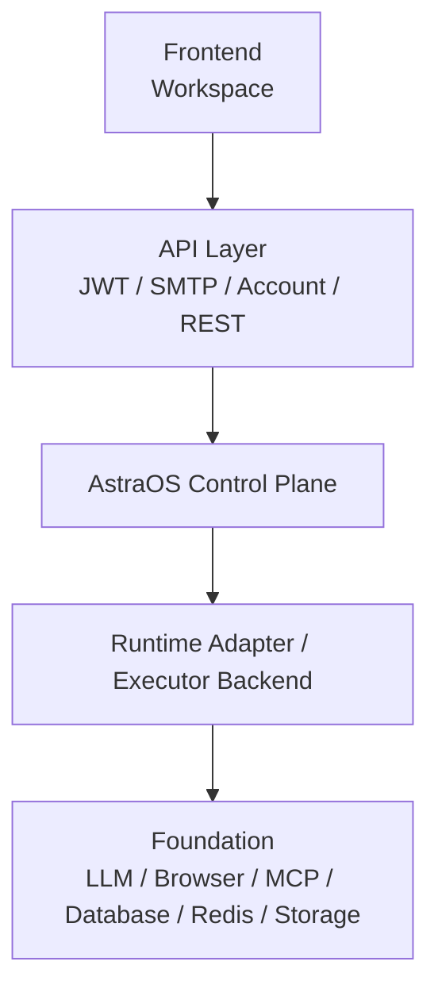

# AstraOS Task-first 工程实现计划

更新时间：2026-07-15

本文档定义 AstraOS MVP 后续开发的工程实现计划。主架构以 `ARCHITECTURE_BASELINE.md` 为准。

## 1. 项目定位

```text
AstraOS 是 Enterprise AI Control Plane。

AI Employee 是运行在 AstraOS Control Plane 上的业务应用。

Agent / Hermes Executor 是执行侧能力的一部分，而不是整个系统。
```

Hermes 自带 Agent Harness；AstraOS 不自研或复制 Harness。

AstraOS 的目标是完成 Task，而不是展示 Agent。

用户不应该被迫理解 Agent、Workflow、Run、Step、ToolCall 等内部对象，才知道一个任务怎么完成。

## 2. 总体层级

系统主层级：



展开后：

```text
Frontend（Workspace）
  -> API Layer（JWT / SMTP / Account / REST）
  -> AstraOS Control Plane
  -> Runtime Adapter / Executor Backend
  -> Foundation（LLM / Browser / MCP / Database / Redis / Storage）
```

Context、Permission、Approval、Audit、Memory 都属于 AstraOS Control Plane 的默认能力，不能被下放为 Hermes 私有能力。

## 3. 正确任务路径

```text
User -> Delegate Task -> Decision Engine -> Runtime Adapter -> TaskResult
```

更完整的工程链路：

```text
Task
  -> Decision
  -> AstraOS Control Plane
  -> Runtime Adapter
  -> Executor Backend（Direct / Tool / Workflow / Hermes）
  <-> Interaction Runtime（需要用户参与时）
  -> TaskResult
```

Workflow 不是所有 Task 的中心。很多 Task 可以直接回答、追问用户，或执行单个工具，不需要完整 Workflow。

## 4. Agent 定义

Agent 的工程定义保持一句话：

```text
Agent = Decision + Capability + Policy
```

说明：

- Decision：判断任务意图、路径、风险、结果标准。
- Capability：声明可用能力和可执行范围。
- Policy：约束权限、审批、风险和审计。

Role、Memory、Execution Profile、Prompt、Persona 都是配置，不是 Agent 的核心定义。

## 5. Control Plane 与 Runtime Adapter 结构

AstraOS Control Plane 是系统主权边界：

```text
Astra OS Control Plane
  ├── User / Organization / Project
  ├── AI App / Employee
  ├── Workflow Definition
  ├── Task / AppRun 状态机
  ├── RBAC / Policy
  ├── Business Approval
  ├── Audit / Usage / Billing
  └── Runtime Adapter
      └── Hermes Executor（可选后端）
          ├── Agent Harness（Hermes 自带，AstraOS 不自研）
          │   ├── Agent Loop
          │   ├── Planning
          │   ├── Tool Calling / MCP
          │   ├── Memory / Skills
          │   └── Subagents
          ├── Execution Timers
          ├── Docker / SSH / Modal Sandbox
          └── Model Adapter / Capability Contract
```

模块定位：

| 模块 | 职责 | 不是 |
| --- | --- | --- |
| Task Intake | 接收用户委托，创建 TaskRequest | 不选择 Workflow |
| Decision Engine | 判断直接回答、追问、执行路径、权限、结果标准 | 不直接写表或调用工具 |
| Planning（可选） | 给用户展示可理解计划 | 不是所有任务必经层 |
| Runtime Adapter | 选择并运行 direct answer、clarification、tool action、workflow 或 Hermes executor | 不绕过权限和审批 |
| Context | 按需装配 Workspace、附件、历史、记忆 | 不无脑塞全部上下文 |
| Permission | 约束本次 Task 可以读写什么 | 不是独立外部服务 |
| Approval | 高风险写入前暂停并等待用户确认 | 不提前写入业务表 |
| Tool | Executor 调用的受控读取、写入或外部动作 | 不是执行流程 |
| Memory | 管理可复用上下文和偏好 | 不是决策本身 |
| Audit | 记录为什么这么做、做了什么、如何恢复 | 不是用户主界面 |
| TaskResult | 交付业务结果、失败原因和下一步 | 不等同于 Run 成功 |

## 6. Decision Engine

Decision Engine 是当前最重要的新增能力。

基础决策类型：

```text
direct_answer
ask_clarification
execute_tool
start_workflow
unsupported
```

Decision Engine 必须输出结构化决策：

```ts
type TaskDecision = {
  id: string;
  task_request_id: string;
  workspace_id: string;
  selected_employee_id: string | null;
  decision:
    | "direct_answer"
    | "ask_clarification"
    | "execute_tool"
    | "start_workflow"
    | "unsupported";
  intent: string;
  confidence: number;
  reason: string;
  risk_level: "low" | "medium" | "high";
  required_context: ContextRequirement[];
  required_permissions: PermissionRequirement[];
  required_approvals: ApprovalRequirement[];
  missing_information: MissingInformation[];
  outcome_spec: OutcomeSpec;
  created_at: string;
};
```

要求：

- `decision` 必须是枚举，不能是自由文本。
- `reason` 必须解释为什么这么决策，供审计和调试。
- `selected_employee_id` 可以为空，因为系统应先理解 Task，再决定是否需要 AI Employee。
- `outcome_spec` 必须存在，因为产品衡量的是 Task 是否完成，而不是 Run 是否结束。
- Decision Engine 不允许直接调用 Tool、写业务表或修改 Runtime 状态。

## 7. Planning

Planning 是 Decision Engine 的可选模块，不是独立层。

适合生成 Planning 的情况：

- 多步骤任务。
- 用户需要确认路径。
- 任务涉及权限、审批或不可逆操作。
- 需要让用户理解失败模式和成功标准。

不需要 Planning 的情况：

- 直接问答。
- 翻译、总结、改写。
- 单个低风险工具动作。
- 澄清问题。

## 8. RuntimeInvocation

进入 Runtime Adapter 的对象必须是结构化 `RuntimeInvocation`，不能是原始 prompt 或未校验的模型自由文本。

```ts
type RuntimeInvocation = {
  id: string;
  task_request_id: string;
  decision_id: string;
  task_id: string;
  workspace_id: string;
  selected_employee_id: string | null;
  invocation_type:
    | "direct_answer"
    | "clarification"
    | "tool_action"
    | "workflow";
  tool_key: string | null;
  workflow_template_key: string | null;
  input: Record<string, unknown>;
  context_bundle_id: string | null;
  permission_grant_ids: string[];
  approval_requirements: ApprovalRequirement[];
  outcome_spec: OutcomeSpec;
  created_at: string;
};
```

要求：

- `workflow_template_key` 只在 `invocation_type = workflow` 时需要。
- `tool_key` 只在 `invocation_type = tool_action` 时需要。
- `permission_grant_ids` 必须绑定当前 Task，不允许使用永久 Agent 授权。
- `approval_requirements` 必须传给 Runtime，由 Runtime 在写操作前强制拦截。
- `outcome_spec` 必须随 invocation 进入 Runtime，不能只存在于前端展示。

## 9. Workspace 体验原则

Workspace 是第一入口。

用户动作：

```text
Delegate Task
Approve Action
Provide Context
View Result
```

普通用户界面展示：

- 当前任务。
- 系统判断。
- 计划（可选）。
- 权限和审批。
- 等待原因。
- 结果交付。

普通用户界面不展示：

- AppRun。
- StepRun。
- ToolCall。
- UsageLog。
- 内部 trace ID。

## 10. 数据域第一页口径

MVP 数据域只需要先讲清楚这些：

```text
Account
Workspace
Employee
Task
Runtime
Marketplace
```

其中：

- Account：用户、邮箱验证、JWT。
- Workspace：用户工作空间和项目容器。
- Employee：运行在 Runtime 上的业务应用配置。
- Task：用户委托、决策、权限、结果。
- Runtime：执行、暂停、恢复、审计。
- Marketplace：分发 Employee Package，并将其安装到 Workspace。

Marketplace 与 Employee Registry 的关系：

```text
Marketplace
  -> Employee Package
  -> Install to Workspace
  -> Employee Registry
  -> Runtime
```

## 11. Foundation

Foundation 是 Runtime 依赖的基础能力，不要让 Codex 自己重新实现这些平台能力。

```text
Foundation
  ├── LLM
  ├── Browser
  ├── MCP
  ├── Database
  ├── Redis
  ├── Storage
  └── Queue
```

说明：

- LLM：模型调用和结构化输出。
- Browser：网页访问、自动化、截图和提取。
- MCP：外部工具和上下文协议。
- Database：业务数据、Runtime 状态、审计记录。
- Redis：短期状态、锁、队列辅助。
- Storage：附件、文件、导出物。
- Queue：Background Job、Retry、Resume Event、Delayed Task。

## 12. 实现顺序

建议顺序：

1. 保持 Workspace-first 前端入口。
2. 补 TaskRequest / TaskDecision / RuntimeInvocation / TaskResult 基础表。
3. 实现 direct answer 和 ask clarification。
4. 实现低风险 tool action。
5. 实现 approval pause / resume。
6. 最后再接入 Workflow executor。

这样可以避免 MVP 被 Workflow 复杂度拖慢。
