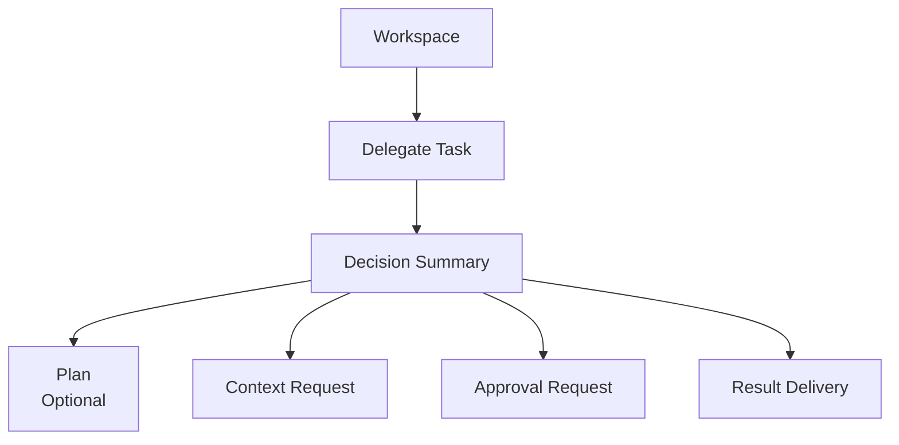

# Workspace 视觉基线

更新时间：2026-07-14

本文档定义旧前端清理后的 Workspace 视觉和交互边界。Workspace 是 AstraOS 的第一入口，它服务于 Task-first Runtime，而不是服务于 Agent 展示。

## 1. 产品定位

```text
AstraOS 是一个 Enterprise AI Runtime。

AI Employee 是运行在 Runtime 上的业务应用。

Agent 是 Runtime 中负责决策的一部分，而不是整个系统。
```

Workspace 的目标是让用户委托任务、确认权限、补充上下文、审批动作、查看结果。

## 2. 保留

- Workspace 作为第一入口。
- 沉浸式、专注、任务委托式界面气质。
- 登录、邮箱验证、工作区列表、工作区详情的视觉骨架。
- 任务输入区、等待态、按钮映射区、结果区的布局位置。
- 用户可理解的任务状态、权限说明、审批卡片和结果交付区域。

## 3. 边界

- Workspace 是用户完成任务的第一入口。
- Admin / Console 只用于治理、观测、审计和调试。
- Runtime Trace 不作为普通用户主界面。
- 固定 demo 业务流不能成为 Workspace 的长期视觉承诺。

## 4. 当前前端状态

Workspace 目前只连接：

- 注册 / 登录 / 邮箱验证。
- 当前账号。
- 工作区创建 / 列表 / 详情。

Workspace 详情页保留未来 Runtime API 位置：

```text
Delegate Task
Approve Action
Provide Context
View Result
```

这些按钮只表达未来 Task-first Runtime 的 API 位置，不连接旧硬编码 runtime。

## 5. Workspace 信息架构



展示原则：

- 展示 Task，不展示 Agent 内部实现。
- 展示系统准备做什么，不展示 prompt。
- 展示需要用户确认的业务动作，不展示 approval ID。
- 展示结果和业务对象，不展示 AppRun / StepRun / ToolCall。

## 6. 文案基线

用户动作：

```text
Delegate Task
Approve Action
Provide Context
View Result
```

状态文案应面向业务结果：

- Waiting for approval.
- Waiting for more context.
- Running task.
- Result ready.
- Needs your attention.

不要面向内部对象：

- AppRun waiting.
- StepRun skipped.
- ToolCall succeeded.
- Workflow template selected.

## 7. 结果展示

Workspace 展示 `Result Delivery`：

- 结果摘要。
- 创建或更新的业务对象。
- 未完成事项。
- 失败原因。
- 下一步建议。

Workspace 不把 Runtime Trace 当成普通用户的主要结果。
