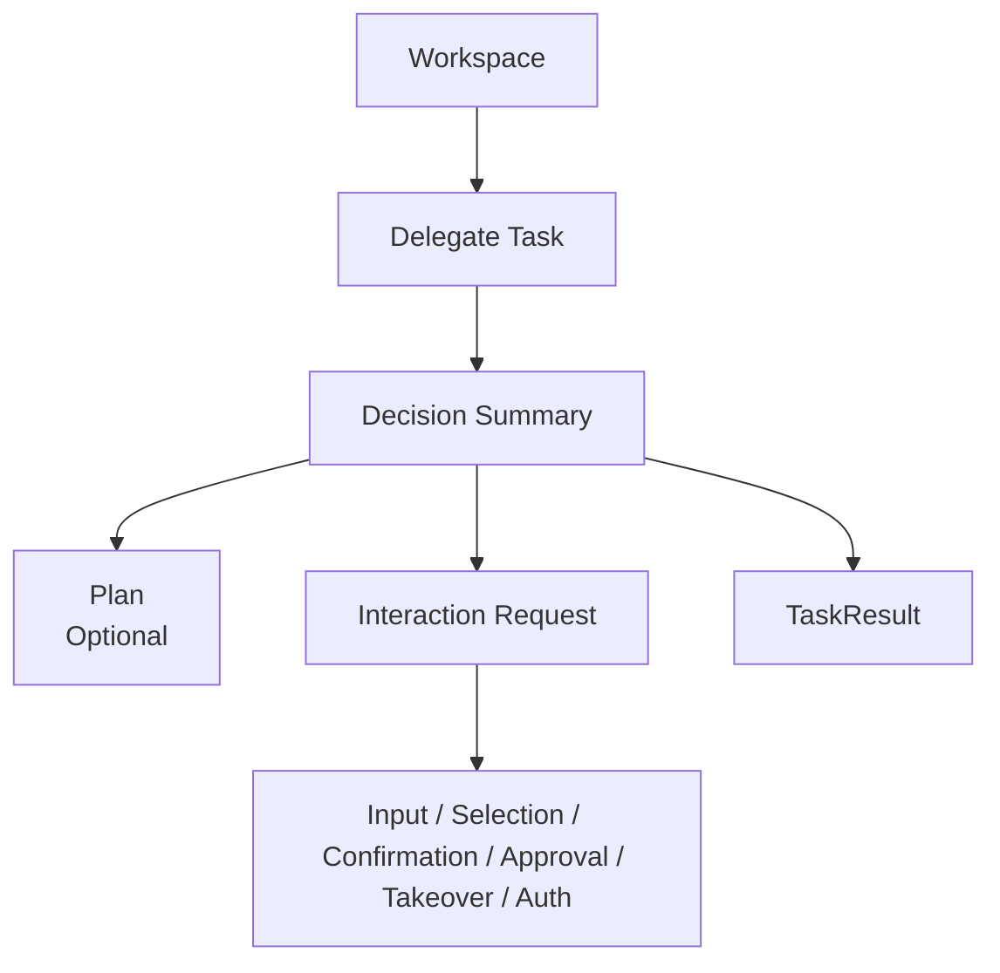

# Workspace 视觉基线

更新时间：2026-07-15

本文档定义旧前端清理后的 Workspace 视觉和交互边界。Workspace 是 AstraOS 的第一入口，它服务于 Task-first Control Plane，而不是服务于 Agent 展示。

Runtime 到 Workspace 的展示与交互契约以 `TASK_PRESENTATION_CONTRACT.md` 为准。本文档只定义 Workspace 在视觉和交互层面的边界。

## 0. 实施范围标记

具体实施时间以 `MVP_SCOPE_AND_LONG_TERM_ROADMAP.md` 为准：

- `[CURRENT]`：登录、邮箱验证、单一 Workspace shell 和明确的 Task unavailable 状态。
- `[MVP-P1]`：Task Composer、Active Task、Needs Attention、Result / History 产品形态和隔离 Preview。
- `[MVP-P2]`：通用 Interaction Renderer、Repository / View Model 接入和完整 Mock 闭环。
- `[MVP-P3]`：真实 context、progress、error recovery 和 TaskResult 状态。
- `[MVP-P4]`：真实单级 approval 和受治理写操作结果。
- `[MVP-CONTRACT]`：takeover、authentication 等长期 renderer 语义；不要求 Gate 4 前接通真实业务流。
- `[DEFERRED]`：Human Work Inbox、Assignment Board、多人协作、组织治理和复杂审批界面。

保留布局位置、renderer kind 或视觉样片不表示对应后端能力已经实现。

## 1. 产品定位

```text
AstraOS 是 Enterprise AI Operating System。

AI Employee 是由 AstraOS Control Plane 定义、由 AstraOS Managed Runtime 托管运行的企业业务责任与治理对象。

Runtime Control Plane 是 AstraOS 的系统层级之一。Agent / Hermes Executor 是执行侧能力的一部分，而不是整个系统。
```

Hermes 自带 Agent Harness；Workspace 不展示 Harness、Agent loop、Skills、Subagents、模型上下文或工具调用循环。

Workspace 的目标是让用户委托任务、确认权限、补充上下文、审批动作、查看结果。

## 2. 保留

- Workspace 作为第一入口。
- 沉浸式、专注、任务委托式界面气质。
- 登录、邮箱验证、单一 Workspace 入口的视觉骨架。
- 任务输入区、等待态、按钮映射区、结果区的布局位置。
- 用户可理解的任务状态、权限说明、审批卡片和结果交付区域。
- 通用 Interaction Renderer，用于渲染输入、选择、确认、审批、结果、接管、进度、失败恢复、文件请求和授权交接。

## 3. 边界

- Workspace 是用户完成任务的第一入口。
- Admin / Console 只用于治理、观测、审计和调试。
- Runtime / Hermes Trace 不作为普通用户主界面。
- Workspace 只消费 Presentation View Model，不直接消费 RuntimeInvocation、ToolCall、WorkflowRun、StepRun 或 Executor session。
- Workspace 不让模型、Executor 或 Hermes 决定组件、布局、按钮、标题或最终 UI 文案。
- 固定 demo 业务流不能成为 Workspace 的长期视觉承诺。

## 4. 当前前端状态

Workspace 目前只连接：

- 注册 / 登录 / 邮箱验证。
- 当前账号。
- 单一 `/workspace` 入口 shell。

Workspace 详情页当前只展示明确的 Task capability unavailable 状态和禁用的 Task Composer，不模拟任务提交、审批、上下文请求或结果：

```text
Task experience is not connected yet
Task submission will be enabled after the Workspace contract is implemented
```

未来的 Delegate Task、Approve Action、Provide Context 和 View Result 必须在正式 Presentation View Model 与 Repository 契约建立后接入，不能以无后端语义的占位按钮表达已存在能力。

正式接入后，Workspace 应从 `WorkspaceTaskView / InteractionView / ResultView` 渲染，不直接从后端内部对象生成页面。

## 5. Workspace 信息架构



展示原则：

- 展示 Task，不展示 Agent 内部实现。
- 展示系统准备做什么，不展示 prompt。
- 展示需要用户确认的业务动作，不展示 approval ID。
- 展示结果和业务对象，不展示 AppRun / StepRun / ToolCall。
- 展示 InteractionView，不展示 InteractionRequest 原始持久化对象。
- 展示风险和影响，不展示内部 policy key。

## 6. 文案基线

用户动作：

```text
Delegate Task
Approve Action
Provide Context
View Result
```

状态文案应面向业务结果：

- Waiting for approval.
- Waiting for more context.
- Running task.
- Result ready.
- Needs your attention.

不要面向内部对象：

- AppRun waiting.
- StepRun skipped.
- ToolCall succeeded.
- Workflow template selected.

不要让模型生成最终 UI 文案。标题、按钮、风险说明、错误提示和审批模板应来自平台模板与 i18n 文案。

## 7. 结果展示

Workspace 展示 `TaskResult` / Result：

- 结果摘要。
- 创建或更新的业务对象。
- 未完成事项。
- 失败原因。
- 下一步建议。

Workspace 不把 Runtime Trace 当成普通用户的主要结果。

## 8. Interaction Renderer

Workspace 使用通用 renderer 承接 Interaction View：

```text
input           -> schema form
selection       -> option picker
confirmation    -> confirmation card
approval        -> approval card
result          -> result view
takeover        -> supervision / takeover panel
progress        -> timeline
error_recovery  -> recovery choices
file_request    -> file upload
authentication  -> auth handoff
```

MVP 必须优先完成 `input / selection / confirmation / approval / result / progress / error_recovery` 中 Customer Support 闭环实际使用的子集。`takeover` 与 `authentication` 在 MVP 中可以只保留组件和契约边界；真实 Human Work 与外部授权流程按 `MVP_SCOPE_AND_LONG_TERM_ROADMAP.md` 后续实施。

Renderer 要求：

- 按 `kind / fields / options / actions / riskLevel` 渲染。
- 所有用户动作都回写为 InteractionResponse。
- `presentationHint` 只能作为展示建议，不能成为后端命令前端打开特定组件。
- 不按单个业务场景硬编码主路径组件。
- 不渲染 `internal_only` 内容。

## 9. 禁止事项

- 禁止把 Runtime / Hermes trace 作为普通用户主界面。
- 禁止把 `RuntimeInvocation`、`ToolCall`、`WorkflowRun`、`StepRun` 作为 Workspace 卡片或导航对象。
- 禁止显示 Browser DOM selector、MCP trace、raw prompt、chain-of-thought、stack trace、cookie、token。
- 禁止让模型直接生成组件名、布局、按钮文案、弹窗标题、风险说明或错误提示模板。
